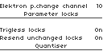
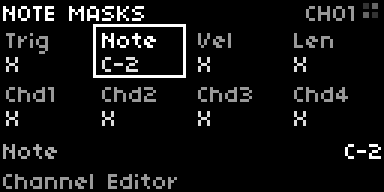
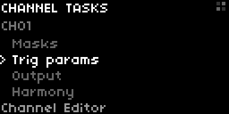
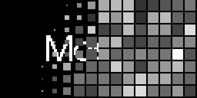
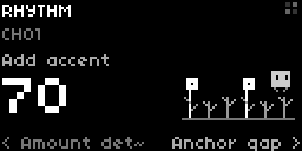
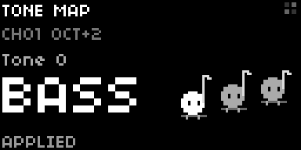
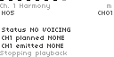

<svg display="none" fill="#000000" version="1.1" id="Capa_1" xmlns="http://www.w3.org/2000/svg" xmlns:xlink="http://www.w3.org/1999/xlink" 
     xml:space="preserve"  width="25px" height="25px" viewbox="0 0 500 500">
     <symbol id="video-icon">
<g>
	<g>
		<g>
			<path d="M370.001,26.35H18.5C8.282,26.35,0,34.633,0,44.85v289.477c0,10.218,8.282,18.5,18.5,18.5h262.662l-20.326-23.571
				h-48.548v-29.603h25.435l-0.183-0.224c-6.49-7.407-10.784-15.061-12.85-22.429H44.4V102.175h299.7V277h-40.213
				c6.104,6.485,12.491,13.053,17.853,18.368c3.759-3.521,8.191-7.416,13.159-11.314c16.925-13.288,33.388-21.414,48.932-24.151
				c1.562-0.274,3.121-0.479,4.672-0.647V44.85C388.501,34.633,380.219,26.35,370.001,26.35z M129.038,299.653h47.175v29.601
				h-47.175V299.653z M45.787,299.653h47.176v29.601H45.787V299.653z M92.963,79.521H45.787v-29.6h47.176V79.521z M176.213,79.521
				h-47.175v-29.6h47.175V79.521z M259.463,79.521h-47.175v-29.6h47.175V79.521z M342.713,79.521h-47.175v-29.6h47.175V79.521z"/>
			<path d="M464.662,354.325c-4.595-24.766-20.357-47.662-29.344-59.11c-12.191-15.53-27.666-21.767-45.99-18.538
				c-13.086,2.305-27.307,9.429-42.271,21.177c-10.572,8.303-18.558,16.611-22.088,20.479c-8.874-7.644-33.651-33.175-45.816-47.571
				c-6.109-7.229-21.865-22.604-33.621-11.991c-12.654,12.301,5.882,32.396,6.362,32.979l74.362,91.024
				c-0.301,0.402-0.637,0.752-1.021,1.055c-7.133,5.601-27.943-4.69-36.344-10.245c-7.68-5.076-20.609-5.037-27.137,0.086
				c-2.612,2.053-4.06,4.842-4.075,7.854c-0.021,4.338,2.815,8.82,8.422,13.313c0.063,0.051,0.177,0.149,0.339,0.289
				c8.286,7.1,30.764,24.782,60.445,35.668c19.027,6.979,37.564,9.854,55.104,8.551c21.754-1.621,42.023-9.693,60.246-24
				C461.781,399.991,469.327,379.461,464.662,354.325z"/>
			<path d="M175.976,127.423c-2.845-2.387-6.815-2.905-10.183-1.335c-3.365,1.57-5.517,4.948-5.517,8.662v100.833
				c0,3.715,2.151,7.092,5.517,8.661c1.291,0.604,2.671,0.897,4.042,0.897c2.204,0,4.386-0.763,6.141-2.233l60.163-50.416
				c2.168-1.817,3.42-4.501,3.42-7.328s-1.252-5.511-3.42-7.327L175.976,127.423z"/>
        </g>
        </g>
        </g>
        </symbol>
</svg>


--- 

Welcome to _Mosaic_, a powerful rhythm- and harmony-focused sequencer designed to unify control over your entire studio. It combines the advanced features of Elektron sequencers with generative and modular techniques, enabling you to craft complex rhythms and harmonies effortlessly. Whether you're sketching ideas or composing full tracks, Mosaic offers a deep and unique musical experience. This manual will help you quickly navigate _Mosaic_ and start creating tunes in no time.

- [Getting Started](#getting-started)
  * [Install](#install)
  * [Setup](#setup)
    + [Hardware](#hardware)
    + [MIDI Device Configuration](#midi-device-configuration)
      - [Stock Devices](#stock-devices)
      - [Adding Custom Devices](#adding-custom-devices)
      - [Mods and Software Devices](#mods-and-software-devices)
      - [MIDI Keyboard Input](#midi-keyboard-input)
      - [MIDI Controller Mapping](#midi-controller-mapping)
  * [Getting Around Mosaic](#getting-around-mosaic)
    + [Sequencer Start and Stop](#sequencer-start-and-stop)
    + [Live Record](#arm-live-record)
    + [Grid Menu Navigation](#grid-menu-navigation)
    + [Norns Menu Navigation](#norns-menu-navigation)
    + [Tooltips](#tooltips)
    + [MIDI Panic](#midi-panic)
    + [Cheat Sheet](#cheat-sheet)
  * [Typical Workflow](#typical-workflow)
    + [Sound Design](#sound-design)
    + [Rhythm Section Design](#rhythm-section-design)
    + [Harmony Design](#harmony-design)
    + [Sequence Composition](#sequence-composition)
      - [Using Merge Modes](#using-merge-modes)
      - [Melody Composition](#melody-composition)
    + [Modulation, Movement, and Interest](#modulation-movement-and-interest)
    + [Song Composition](#song-composition)
- [Dig Deeper](#dig-deeper)
  * [Pattern Editor](#pattern-editor)
      - [Adding Trigs](#adding-trigs)
        + [Rhythm Doctor](#rhythm-doctor)
      - [Adding Notes](#adding-notes)
      - [Adding Velocity](#adding-velocity)
  * [Channel Editor](#channel-editor)
    + [Devices](#devices)
      - [MIDI Sound Sources](#midi-sound-sources)
      - [Norns Sound Sources with n.b.](#norns-sound-sources-with-nb)
      - [Device Parameters](#device-parameters)
    + [Adding Patterns to Channels](#adding-patterns-to-channels)
    + [Masks](#masks)
      - [Adding Trig Masks](#adding-trig-masks)
      - [Adding Melodic Notes over Harmony and Drums](#adding-melodic-notes-over-harmony-and-drums)
      - [Adding Chords](#adding-chords)
      - [Removing Masks](#removing-masks)
    + [Merge Modes](#merge-modes)
      - [Trig Merge Modes](#trig-merge-modes)
      - [Note Merge Modes](#note-merge-modes)
      - [Velocity Merge Modes](#velocity-merge-modes)
      - [Length Merge Modes](#length-merge-modes)
    + [Note Dashboard](#note-dashboard)
    + [Clocks, Swing and Shuffle](#clocks-swing-and-shuffle)
    + [Memory (undo and redo)](#memory-undo-and-redo)
    + [Channel Length](#channel-length)
    + [Muting Channels](#muting-channels)
    + [Trig Parameters](#trig-parameters)
      - [Sequencer Params](#sequencer-params)
        + [Trig Probability](#trig-probability)
        + [Fixed Note](#fixed-note)
        + [Quantised Fixed Note](#quantised-fixed-note)
        + [Random Note](#random-note)
        + [Random Twos Note](#random-twos-note)
        + [Chord Strum](#chord-strum)
        + [Chord Arpeggio](#chord-arpeggio)
        + [Chord Acceleration](#chord-acceleration)
        + [Chord Spread](#chord-spread)
        + [Chord Velocity Modifier](#chord-velocity-modifier)
        + [Chord Shape Modifier](#chord-shape-modifier)
        + [Mute Root Note](#mute-root-note)
        + [Fully Quantise Mask](#fully-quantise-mask)
  * [Scale Editor](#scale-editor)
    + [Transposition](#transposition)
  * [Song Editor](#song-editor)
    + [Button Indicators](#button-indicators)
    + [Interacting with Slots](#interacting-with-slots)
    + [Song Mode Operations](#song-mode-operations)
    + [Adjusting Song Sequence Length](#adjusting-song-sequence-length)
    + [Navigating the Norns Display](#navigating-the-norns-display)
  * [Locks](#locks)
    + [Trig Param Locks](#trig-param-locks)
      - [Param Slides](#param-slides)
    + [Mask Locks](#mask-locks)
    + [Scale Locks](#scale-locks)
    + [Transposition Locks](#transposition-locks)
    + [Octave Locks](#octave-locks)
  * [Save and Load](#save-and-load)
  * [Options](#options)
    + [Sequencer Options](#sequencer-options)
      - [Song Mode](#song-mode)
      - [Reset at Sequence End](#reset-at-sequence-end)
      - [Reset at Seq Pattern End](#reset-at-seq-pattern-end)
      - [Param slides wrap](#parameter-slides-wrap)
      - [Elektron Program Changes](#elektron-program-changes)
      - [Elektron Program Change Channel](#elektron-program-change-channel)
    + [Parameter Lock Options](#parameter-lock-options)
      - [Trigless Locks](#trigless-locks)
    + [Quantiser Options](#quantiser-options)
      - [Snap Note Masks to Scale](#snap-note-masks-to-scale)
      - [Quantise Note Masks](#quantise-note-masks)
      - [Scales Lock Until Pattern End](#scales-lock-until-pattern-end)
      - [Lock All to Pentatonic](#lock-all-to-pentatonic)
      - [Lock Random to Pentatonic](#lock-random-to-pentatonic)
      - [Lock Merged to Pentatonic](#lock-merged-to-pentatonic)
    + [MIDI Controller Options](#midi-controller-options)
      - [Map Scale to White Keys](#map-scale-to-white-keys)
      - [Honor Scale Rotations](#honor-scale-rotations)
      - [Honor Scale Degree](#honor-scale-degree)
  * [Sinfonion Connect](#sinfonion-connect)
  * [LFOs and Modulation](#lfos-and-modulation)
- [Performance Management](#performance-management)
- [Development](#development)
  * [Roadmap](#roadmap)
  * [Interesting Components for Norns Script Developers](#interesting-components-for-norns-script-developers)
- [Device Config Creator](#device-config-creator)

## Getting Started

### Install

Install using the Norns community catalogue or simply run `;install https://github.com/subvertnormality/mosaic` in maiden.

Note: please remove alpha or beta versions of Mosaic if installed, including the data/mosaic

### Setup

#### Hardware

_Mosaic_ requires a Norns and a 128 Grid at a minimum. With these you will be able to create simple songs using [n.b. devices](#norns-sound-sources-with-nb), but _Mosaic_ is really designed to unify control of your entire studio over MIDI. All devices with MIDI in are all supported, although those set up in _Mosaic_ using pre-existing or manually created configuration files are optimal. Crow, Just Friends, and Ansible are natively supported using [n.b.](#norns-sound-sources-with-nb).

Using [MIDI input](#midi-input) devices, while not essential, enhances the user experience. A MIDI keyboard simplifies melody creation, and a MIDI controller with encoders supporting relative bin offsets can improve the data input process.

For those using an ACL Sinfonion, support is available through a straightforward [hardware build](#sinfonion-connect). This setup allows synchronization between Mosaic's quantization and the Sinfonion Eurorack module.

#### MIDI Device Configuration

##### Stock Devices

Mosaic includes a range of stock midi devices that you can integrate into your setup. Elektron Digitone, Digitakt 2, Syntakt, and the Nord Drum 2 are first class citizens with fully tailored mappings.

First, they need to be configured to appear in the device selector. Here's how to set this up using [maiden](https://monome.org/docs/norns/maiden/):

1. **Access Configuration Files**: Open Maiden and navigate to the directory path `code > mosaic > lib > config`. Here, you will find the stock device configuration files.
2. **Create a New Configuration Folder**: Next, go to the directory `data > mosaic`. In this location, create a new folder named `config`.
3. **Copy Configuration Files**: Copy the device configuration files that you wish to use from `code > mosaic > lib > config` into the `data > mosaic > config` folder you just created.
4. Once these steps are completed, Mosaic will automatically load the device configurations you've selected, and they will be available in the device picker on the channel page.

This allows you to easily access and use only your preferred devices within Mosaic.

##### Adding Custom Devices

Once you've copied the stock device configuration files into the `data > mosaic > config` folder, you can also personalise these configurations to better suit your setup. This is particularly useful for setting common defaults like the MIDI output device.

You can customise Mosaic to perfectly align with your studio setup by configuring it to work seamlessly with your specific devices. If your device is not included in the standard configuration, create a .json file named after your device in the `dust > mosaic > config` folder. Populate this file using a config file customised to match your device's MIDI specifications. You can create, load and edit midi device config files using the [Mosaic Config Creator](https://subvertnormality.github.io/mosaic/config_creator.html).

##### Lock lead time

In the Norns params menu, open **MOSAIC → Parameter locks → Lock lead time (ms)**.
This global setting accepts 0–50 ms and defaults to **25 ms**. It gives MIDI CC/NRPN
parameter locks time to settle before the note attack, particularly on devices
that smooth incoming controllers. Set it to **0** to send each value at its own
step, which is the original output timing. The value is saved with Mosaic's
project settings.

A step's parameter values leave ahead of the step, in an earlier clock pulse.
Nothing is delayed to achieve this: note-ons, note-offs, live MIDI-thru, outgoing
MIDI Clock, Start, Continue, Stop and song position all keep the timing they have
at a lead of 0, and gate lengths are unchanged. N.b. players are unaffected.

Because a value leaves on a clock pulse, the wait it achieves is the setting
rounded **up** to the next whole pulse, so a value never leaves with less lead
than was asked for. At 130 bpm a pulse is about 4.8 ms, so a 25 ms setting
delivers about 28.8 ms; at 200 bpm it delivers 25 ms exactly. The figure follows
the tempo, and every value of a step leaves on the same pulse, so what you hear
stays consistent between events rather than fixed to the number in the menu.

No step is looked ahead musically: probability, conditions, fills, random notes,
strum, arps and micro-timing still make their decisions at their own times. Only
the parameter values a step will send are resolved early.

Every note sounds with its own step's values. When two notes on the same MIDI
channel are less than twice the lead apart (a fast tempo, a fast channel clock,
or swing and shuffle bringing steps together), a value does not take the whole
lead: it waits until halfway between the previous sounding note and its own step.
The previous note keeps its value through the first half of the gap, and the new
value settles in the second half. A trigless step sounds nothing, so it is not
the note a later value waits behind. A strummed chord's later voices are sounding
notes, so the next step's values wait behind the last of them.

An address that more than one slot writes, whether two slots of one channel or
two channels addressing one device parameter, is not sent early: its values leave
at their own step, in the order the step would send them at a lead of 0.

Two cases give no lead at all. The first step after Play resolves its lock on the
transport's own first pulse, so there is no earlier pulse for its values to leave
in and they leave with the note. A parameter that is mid-slide keeps its slide
until the slide's destination step, so that step's lock arrives with the step
rather than before it. Nothing is delayed to hide either case.

The lead covers the time a receiver takes for a parameter change to take effect,
so every value follows the same rule whether or not its step has a note: trigless
locks, assigned values and slide values leave ahead of the step they belong to and
take effect as that step is heard.

Editing a lock that has already left changes what the next pass sends, and the
edited value is sent again at its own step, so the receiver is corrected rather
than left holding the superseded value. Mosaic restores its output hooks on
cleanup; stop and panic release held voices without leaving queued output behind.



##### Mods and Software Devices

Mosaic can also use internal Norns sound sources and manage devices like Crow, Just Friends, and Ansible via i2c by installing [n.b.](https://github.com/sixolet/nb/) mods. These mods will appear in Mosaic's device list once installed and activated in the Norns settings menu. Ensure the n.b. mod is on the allow list to use with Mosaic. See [Norns sound sources with n.b.](#norns-sound-sources-with-nb) for more information.

##### MIDI Keyboard Input

You can input notes, velocity, and chords using a MIDI keyboard. You can do this live, using live record, or by holding down a step and pressing the keys on your keyboard. When setting on a per step basis, the length of these inputs requires manual selection. To do this, ensure you have your desired channel selected on _Mosaic_. Then, while holding the desired step, press the corresponding key on your keyboard. If you are on the mask page of your Norns, the values you input will display as locks.

By default, the keyboard plays the keys you press. Enable "Map scale to white keys" in the settings of Mosaic to map the currently selected scale to the white keys, with the root note of your selected scale starting from C, to better suit your musical preferences or project requirements.


##### MIDI Controller Mapping
_Mosaic_ provides comprehensive support for MIDI mapping of channel controls through the Norns MIDI Map function. This allows you to assign MIDI controls to various parameters, enabling real-time control via compatible MIDI hardware. Your MIDI device must support relative (binary offset). 

To map your MIDI device to a channel control, navigate to the parameters menu on your norns device and scroll down to the "Mosaic Midi Mapping" section. Select your desired control type and enter the parameters menu on your Norns by holding K1 and pressing K3 (enter key). Now select your desired parameter.

Map "selected channel parameters" when you want to control a specific parameter of the currently selected channel. Map "channel parameters" when you want to control a parameter of a specific channel regardless of which channel is selected.

Configure your parameter map as follows:

Input (In) range: 1 to 2
Output (Out) range: -1.0 to 1.0
Accumulation (Accum): Enabled (set to "Yes")

Trig params, masks and channel memory are all able to be mapped to your MIDI device.

<p>
  <svg width="25" height="25" viewBox="0 0 500 500" style="vertical-align: middle;">
    <use href="#video-icon" />
  </svg>
  <a href="https://www.youtube.com/watch?v=iGx5fmrbatA&t=802s">MIDI controller mapping demo</a>
</p>

## Getting Around Mosaic

### Sequencer Start and Stop

To start the sequencer, press the lowest left hand button on the grid. To stop the sequencer, press the button again.


<p>
  <svg width="25" height="25" viewBox="0 0 500 500" style="vertical-align: middle;">
    <use href="#video-icon" />
  </svg>
  <a href="https://www.youtube.com/watch?v=J1ckUZvhFJ0&t=632s">Start and stop functionality demo</a>
</p>

### Arm live record

To enable record mode, press the second button from the left on the grid.

When record mode is active, any notes played on a MIDI keyboard will be captured as note masks on the currently selected channel. This includes note lengths and chords. All recordings are quantised to align with the current step: the step active when Mosaic processes the note-on, rather than the nearest step. An incoming MIDI clock pulse and a sequencer step transition are separate events; a note processed before the transition still belongs to the preceding active step. A recorded chord has one shared note length, measured from the first key press to the final key release and quantised to the nearest supported note length. This applies even when the chord keys are pressed or released at different times. Disarming recording prevents new notes from being recorded. Notes that began while recording was armed are kept, and their full note lengths are measured and committed when you release them, even if recording has since been disarmed.

While recording is armed, editing a trig parameter starts recording that parameter’s value on subsequent eligible steps processed for the selected channel. Already-processed steps are unchanged. Only edited parameters are recorded, overwriting their existing locks through the channel’s final step; recording clears before its next starting step is processed while the channel remains selected. Further encoder edits update or restart recording. Grid Stop or disarm clears pending parameter recording. Active MIDI values are sent again before each eligible step’s note, even when the value has not changed. Selecting another channel or the Scale Editor pauses this parameter recording; returning resumes on the next eligible step unless that step clears recording at the selected channel’s wrap. Wraps while the channel is not selected leave its pending values intact. An active recorded value cancels that slot’s existing slide at the next eligible step. Off sends nothing and leaves an existing slide running. Changing a parameter assignment clears its pending recording; confirming the same assignment preserves it. Applying a MIDI device, channel or port change resets the device locks, assignments, defaults and pending parameter recording. Unconfirmed changes and cancellation leave the original recording intact.

With Trigless Locks off, parameter values are recorded only on active steps. When it is on, every step is eligible. Trigless Locks is enabled by default.


<p>
  <svg width="25" height="25" viewBox="0 0 500 500" style="vertical-align: middle;">
    <use href="#video-icon" />
  </svg>
  <a href="https://www.youtube.com/watch?v=iGx5fmrbatA&t=143s">Live recording notes</a>
</p>

<p>
  <svg width="25" height="25" viewBox="0 0 500 500" style="vertical-align: middle;">
    <use href="#video-icon" />
  </svg>
  <a href="https://www.youtube.com/watch?v=iGx5fmrbatA&t=640s">Live recording trig locks</a>
</p>


### Grid Menu Navigation

The four buttons starting from the third column on the lowest row serve as the global menu buttons. From left to right, these buttons allow access to the [Channel Editor](#channel-editor) and [Scale Editor](#scale-editor):


<p float="left">
  
   
</p>

As well as the [Pattern Editors](#pattern-editor) and [Song Editor](#song-editor):

<p float="left">
  
  
</p>

The pattern editor button cycles through three pages, accessible by pressing the button repeatedly. These are the [Pattern Trig Editor](#adding-trigs), the [Pattern Note Editor](#adding-notes), and the [Pattern Velocity Editor](#adding-velocity).

<p>
  <svg width="25" height="25" viewBox="0 0 500 500" style="vertical-align: middle;">
    <use href="#video-icon" />
  </svg>
  <a href="https://www.youtube.com/watch?v=J1ckUZvhFJ0&t=330s">Global navigation demo</a>
</p>

### Norns Menu Navigation

The Norns screen follows the grid. Press a global menu button and the screen shows that page. Select a channel and the screen shows it. Hold one or more steps and the Channel screen shows the masks or trig params of exactly those steps, then returns to where you were when you let go. Most of the time you play the grid and glance at the screen; you only navigate the screen to reach settings.



Every screen has the same parts. The title row names the screen and its scope: the channel (`CH03`), the song slot when it is not the first (`S02`), and any held steps (`ST05` for one step, `3ST` for several). A Channel screen also shows `MUTE` when the channel is muted, its octave when it is not 0 (`OCT+1`), and a held step's octave lock (`O-1`); the pattern editor names the pattern it edits before the channel it shows (`PAT02 CH01`). The selected field is outlined or marked with `>`, and its whole value is always shown, on the bottom line of a grid of fields or in large type on a single-field screen. The last line lists the controls for the screen, or shows a tooltip after a grid action. A grid action brings up the screen that shows what it changed, with that value chosen: a merge button or a pattern assignment shows Merge modes (where E2 and E3 also change the trig, note, velocity and length merge modes, including the pattern-priority ones), a channel scale lock shows Scale source, global transposition and scale-track locks show Scale overview, and the song length fader shows Song playback. K2 or E1 then carries on from there. Screens that only show information, such as Scale overview, Song playback and Paint preview, list every value at once with no cursor. The four small tiles at the right of the title row are _Mosaic_'s mark; they light up in turn when something changes.

The controls work the same way on every screen:

- **E1** opens the page's task list from any screen. In a task list, E1 or E2 moves through the rows and K3 opens the chosen one.
- **E2** chooses a field, or a row in a task list.
- **E3** changes the chosen value. Hold K1 while turning E3 for fine changes where a value supports them.
- **K3** opens the chosen task, applies a staged change, or confirms a question.
- **K2** goes back, or cancels a staged change or a question.
- A short **K1** tap opens the norns system menu. Holding K1 is the shift key for grid and screen gestures.

Task lists name everything a page can show. Channel tasks: Masks, Trig params, Output, Harmony, Clock, Merge modes, Device, History and Merge Shape. Scale tasks: Scale, Scale clock and Overview. Pattern tasks: Pattern, Options, Algorithm, Channel view and, while the Rhythm Doctor algorithm is chosen, Rhythm Doctor. Song tasks: Playback, Slot setup, Tempo and feel, and Channel view. _Mosaic_'s other settings, such as projects, sequencer options, MIDI mapping and each channel's device parameters, are in the norns PARAMS menu under MOSAIC: tap K1 to open it, as the Channel tasks footer reminds you.



Some settings are staged before they take effect. Device, clock, scale and song settings show your change straight away but only apply when you press K3. K2, or leaving the screen with E1, cancels a staged change without touching what is already playing. [Merge Shape and Harmony](#musical-merge-and-voice-leading) keep a whole draft in the same way.

When _Mosaic_ starts, the dots and bars of the _Mosaic_ logo lay themselves down across the screen, row by row, then lift away to leave the _mosaic_ wordmark, which fades into the first screen. Any key, encoder or grid press skips it. Screens change instantly, without a transition. The start-up animation and the characters' movement can be turned off with [UI Motion](#ui-motion).



<p>
  <svg width="25" height="25" viewBox="0 0 500 500" style="vertical-align: middle;">
    <use href="#video-icon" />
  </svg>
  <a href="https://www.youtube.com/watch?v=J1ckUZvhFJ0&t=490s">Norns navigation demo</a>
</p>

For a detailed reference on the layout of your Norns device, consult the official [Norns documentation](https://monome.org/docs/norns/).

### Tooltips

Most _Mosaic_ functions are described by tooltips that appear at the bottom of the Norns screen when activated. If you're not sure what a button does, try pressing it and watching out for the tooltip. When no tooltip is showing, the bottom line lists the controls for the current screen.

### External MIDI Transport

With the norns clock source set to MIDI, external MIDI Clock drives Mosaic at 24 pulses per quarter note. Norns receives clock from all connected MIDI devices by default; use **CLOCK > midi clock in** to select one input when other devices also send transport or clock. Mosaic follows received pulse order: a missing pulse delays later step boundaries and an extra pulse advances them; norns estimates timing between received pulses from recent intervals. If clock pulses disappear without Stop, norns continues at its last acquired tempo and does not infer Stop. A later external Start marks the next Clock as beat zero. When that Clock arrives, Mosaic releases held notes and resets to step 1, including when it is already playing. Restart cleanup does not send a MIDI Stop back to connected devices; an ordinary Stop still releases notes and sends Stop. The grid Play button starts Mosaic locally at the current clock phase.

Pinned norns does not interpret MIDI Continue or Song Position Pointer as clock-transport commands. Mosaic therefore remains stopped when it receives them and does not reposition; send MIDI Start to begin again from step 1. The messages remain available to scripts through the normal MIDI event API.

### MIDI Panic

Should your MIDI output devices become unresponsive, hold the navigation button of a non-selected page to send Note Off messages for every note on every MIDI channel and connected device. Panic clears sounding notes with a short sweep; it does not stop the sequencer or cancel scheduled strum or arpeggio voices. Playback and scheduled voices continue, so new notes can sound during or after the sweep. Use the Play/Stop control to stop playback. Holding the selected page button does not trigger panic, and releasing a panic hold does not change pages.

### Cheat Sheet

A quick reference of the grid buttons and common commands and shortcuts can be found in the [Mosaic Cheat Sheet](https://subvertnormality.github.io/mosaic/cheat_sheet.html).

## Typical Workflow

This section provides an overview of Mosaic's functionality and basic operations, outlining a typical workflow for song creation. Here, we present a broad perspective without going into the operational specifics. For more detailed information on navigating through the user interface, understanding precise functionalities, exploring options, and more, please refer to the [Dig Deeper](#dig-deeper) section. This should allow you to grasp the essential processes first, setting a solid foundation for more advanced exploration later.

### Sound Design

The initial stage of song creation with _Mosaic_ involves setting up a few basic voices. These preliminary sound designs may evolve, but it's useful to have a basic foundation for developing the rhythmic, harmonic, and melodic aspects of your track.

Start by selecting the device for each element of your composition, whether it be an internal Norns player, an external drum machine or synthesizer, or components of a modular patch. To do this, assign each device to a Mosaic [channel](#channel-editor) as detailed in the [device](#devices) section. Organizing different instruments can be helpful; for instance, group drums on channels 1-6, harmonic and textural elements on channels 7-10, melodic elements on channels 11-14, and reserve channels 15 and 16 for modulation. Adapt these assignments to suit your specific musical style and needs.

With your devices assigned, you're ready to begin the rhythm and harmony design process.

### Rhythm Section Design

The rhythm of your track is crafted using the [pattern editor](#pattern-editor), accessible by pressing the third button in the global menu cluster located at the bottom left of your grid. A pattern in Mosaic is defined as a sequence composed of 64 steps with trigs, notes, velocities, and duration data. Patterns are the building blocks of your rhythm section.

The pattern editor provides multiple tools to create these building blocks. You can input trigs manually in an XOX style, or choose from predefined banks featuring bass, snare, and hi-hat patterns. For more complex needs, explore using Euclidean patterns or patterns from Noise Engineering's Numeric Repetitor. To add unique rhythmic variations, apply a tresillo modifier, which introduces a 3-3-2 repeating pattern. These rhythm types can be blended by selecting and "painting" them onto the grid. It's possible to paint more than one pattern at a time, and then edit further to taste XOX style. To learn more about this process, refer to the [Adding Trigs](#adding-trigs) section.

After establishing a pattern of trigs, assign relative [notes](#adding-notes) and [velocity](#adding-velocity) data. These patterns will later be merged and remixed to form your rhythm and harmony sections.

### Harmony Design

_Mosaic_'s harmony tools enable you to compose your song's chordal progressions. These progressions can dynamically modulate your patterns, allowing for the creation of complex harmonic sequences with minimal music theory knowledge.

Harmonic progressions can be applied globally — modulating all notes across all channels to the same key, degree, and scale rotation — or on a per-channel basis, affecting only the notes within that channel. This decoupling of patterns and notes from the active scale enables dynamic and experimental tonal modulations. For example, setting your global scale to change in a polyrhythmic pattern relative to your channel's note data can create captivating musical textures.

Each project supports 16 scale slots. Each slot includes a root note, a scale type (e.g., Dorian, Major), a degree, transposition, and a scale rotation. The [Scale Editor](#scale-editor) is where you craft the scales that will form your chord progressions, and you can sequence these using [Scale Locks](#scale-locks) either globally from the scale editor, or per channel using the channel editor.

### Sequence Composition

At this point you will have a set of sound sources attached to a number of channels, a set of patterns with relative notes, trigs, velocities, and lengths, and a set of scales that work well together - possibly assigned as either a global scale or a set of trig locks on the global scale editor. Now it's time to compose your first sequence. The pattern tools offer the ability to craft intricate rhythmic and harmonic sections. However, the true heart of Mosaic is the [Channel Editor](##channel-editor). The channel editor is used to lay out your harmonic and rhythm sections by [adding patterns to channels](#adding-patterns-to-channels).

#### Using Merge Modes

When assigning multiple patterns to a single channel, you might notice that overlapping steps in different patterns deactivate. This occurs because the default "skip" merge mode is active. [Merge Modes](#merge-mode) control the behavior of these overlaps, allowing patterns to be combined in different combinations across multiple channels whilst interacting in harmonically meaningful ways. Experiment with different merge modes to explore various musical interactions.

#### Melody Composition

The [Channel Editor](##channel-editor) doesn't merely allow you to add, merge, and apply scales to patterns; it enables you to enhance them with melodies and other elements to further enrich your music. In fact, you could compose entire songs using just the channel editor if you wanted to, thanks to [Masks](#masks). Masks provide a direct method to input triggers, notes, velocities, and chords right into the channel editor grid, giving you precise control over your musical creations. You can overwrite pattern values or create entirely new steps.

Use the live recording mode to play your melodies directly over your rhythm and harmony patterns. Then record in automation directly by altering trig params whilst recording.

### Modulation, Movement, and Interest

Even a song crafted with compelling chord progressions, engaging rhythms, and striking melodies can sometimes sound flat when produced on electronic devices. The secret to invigorating such tracks lies in the addition of dynamics, movement, and interest, which is often achieved through thoughtful and abundant modulation. _Mosaic_ provides robust tools for modulation, including [Trig Parameters](#trig-parameters) and [Trig Locks](#trig-locks). "Trig lock" is a term borrowed from Elektron, referring to the ability to fix a parameter to a specific value at a certain step in the sequence. This feature allows you to control any MIDI device parameter, modulation parameter, the octave of a note, and even the scale to which the note is quantised, at each step, offering precise manipulation over the quality and dynamics of your music. 

### Song Composition

At this point, your sequence is likely "full to the brim," containing all the elements of your song in its most complex form. For those familiar with Elektron devices, this stage can feel like a precarious juncture, where it's tempting to fall into a cycle of making minor adjustments to the same pattern repeatedly. _Mosaic_ offers a solution with its [Song Editor](#song-editor), designed to help you break free from this procrastination loop.

To access the song editor, press the last key in the global menu's Grid button cluster. You'll be greeted by a grid where the first button is dimly lit, indicating the sequence you are currently working on. The song editor allows you to take this sequence, copy it, and creatively manipulate the copy: you can mute channels, modify scale locks, alter pattern combinations and merge modes, adjust masks, and more. You can then chain multiple sequences together. This flexibility enables you to develop your composition from the base sequence upwards. As you become accustomed to this workflow, you'll find that you can construct an entire song from a single sequence, streamlining your creative process.

## Dig Deeper

Now that you have a grasp of the basic workflow, we'll dig into the more advanced functionalities of _Mosaic_. This section will explore the deeper capabilities and features that allow for sophisticated manipulation and fine-tuning of your music, enabling you to fully harness the potential of this powerful sequencer.

### Pattern Editor

Patterns serve as the foundational elements of your harmony and rhythm sections. You start by creating a set of patterns using the pattern editor tools. Once established, these patterns can be merged and remixed within the channel editor to construct and enhance your song. This approach allows you to experiment with different combinations and sequences, giving you the flexibility to refine and evolve your musical ideas into a cohesive composition.

Access the pattern editor by pressing the third key in the global menu cluster on your Grid.

<p>
  <svg width="25" height="25" viewBox="0 0 500 500" style="vertical-align: middle;">
    <use href="#video-icon" />
  </svg>
  <a href="https://www.youtube.com/watch?v=J1ckUZvhFJ0&t=660s">Pattern editor demo</a>
</p>

#### Adding Trigs

Trigs are added in the pattern editor. Using the top row, pick one of the 16 available patterns.


To set your rhythm, simply tap in steps using the sequencer. Bright steps symbolise a trig. To define its length, press and hold a trig, then choose its ending step. Steps with a subtle glow show the length. In a single pattern, one trig's duration ends upon meeting another.


Craft unique rhythms using a variety of built-in algorithms. The algorithm is selected using the five algorithm select buttons. From left to right:

* Button 1: The drum algorithm, drawing from a rich collection of classic drum patterns.
* Button 2: The tresillo algorithm, utilizing a 3/3/2 ratio for diverse rhythm variations. The tresillo multiplier can be set on the Norns screen for more variations.
* Button 3: Euclidean, a rhythm tool rooted in mathematical logic.
* Button 4: NE Numeric Repetitor, another rhythm tool based on mathematical principles.
* Button 5: Rhythm Doctor, a capture and paint workflow described below. Recording needs the sequencer stopped; an analysed bank can be used while it plays.

Pressing an algorithm button shows the Trig Algorithm screen on the norns, with the algorithm in use marked SELECTED. You can also choose there: E2 moves through the five algorithms and K3 selects one, exactly as its grid button does. Choosing Rhythm Doctor opens the Doctor. Algorithm, in the pattern task list, opens the same screen.


##### Rhythm Doctor

Rhythm Doctor is the fifth pattern-editor algorithm, at grid column 16, row 2.
It keeps one captured bank per project and lets you preview a 64-step window
from one selected lane before painting it into the selected pattern.

The lanes occupy a block of five columns on each of two rows, starting at
column 3: lanes one to five on row 2 at columns 3–7, and lanes six to ten on
row 3 at the same columns. Column 1 of row 2 is Record, column 2 is reserved,
and columns 12–16 of both rows belong to the algorithm and bank-mask faders and
are never lanes. A bank analysed on the device declares three lanes — **BD**
(bass drum), **SD** (snare drum) and **CYM** (hi-hats and cymbals) — so only
the first three cells light. A remote analysis declares up to ten, which is why
the block is two rows: a single row would run the later lanes under the
algorithm fader, where selecting one would also change the algorithm.

Lanes read in kit order rather than alphabetically: kick, snare, hi-hat,
cymbals and toms fill the top row, and whatever else the analysis separated out
— bass, guitar, piano, vocals and demucs' residual **OTHER** — follows on the
bottom row. A lane neither of those names keeps a stable alphabetical place
after the ones they do, so an unfamiliar backend still puts its columns in the
same order every time a project loads. A bank saved before this order existed
is brought forward when it loads, so an older capture does not keep an
alphabetical grid until it is recorded again.

The lanes describe what can be told apart reliably, not a full drum-kit
transcription. **CYM** is hats *and* cymbals together because a closed hat and a
ride are both inharmonic metal with overlapping spectra, and the decay that
distinguishes them in isolation is buried in a mix; separating them was measured
and does not work. Bass, open hi-hat and tom have no lane: none could be
detected reliably enough to paint. Bass was tried and withdrawn — every
approach either failed to separate a bass note from the kick that hides it, or
marked the kicks themselves, so the lane only ever restated what BD already
said.

Recording needs the sequencer stopped, because capture takes over the audio
input and analysis replaces the bank underneath whatever is on the screen. So
does Alignment, which re-analyses. Record, capture setup and Alignment do
nothing while the sequencer runs, and the screen says `STOP SEQUENCER` when
there is no bank to work on instead.

A bank that has already been analysed stays usable while the sequencer plays.
Choosing a lane, browsing the recording, changing sensitivity or paint policy,
and previewing and painting all read a finished bank and write to a pattern,
which is what the rest of the Trigger Editor already lets you do while playing.
Starting the sequencer cancels an unfinished capture or analysis and closes a
capture-setup or alignment draft, but keeps an armed paint preview, so you can
arm Paint, start the sequencer and commit. Rhythm Doctor does not start or stop
the sequencer for you.

On an empty bank, press grid column 1, row 2 to begin Record; the press starts
the action and its release is consumed. Press Record again to stop, or press K3:
either finishes the capture once the screen says `ENOUGH / REC OR K3`. Until it
does, the screen says `MORE AUDIO NEEDED`, and pressing Record then asks whether
to abandon the take instead. Pressing Record on an occupied bank asks whether to
clear its capture bank. K2 cancels that question and K3 confirms it; clearing keeps patterns that
were already painted. In a ready bank, use E2 to choose Window bar, Window
step, selected-lane sensitivity, Paint policy, or Alignment, then use E3 to
edit the chosen item. Window bar moves by 16 steps and Window step by one; both
view the same bounded timeline. Choose Alignment and use E3 to open its tempo,
start-beat, and fine-start settings; K2 cancels and K3 applies the draft.

Before recording, E2/E3 open a draft setup for Auto or Manual tempo, manual BPM
(40–240), and Stereo/L/R input; K2 discards the draft and K3 keeps it. The
current build presents these settings but does not pass manual BPM or the input
selection to the capture or analysis backend, so they are not an audio-routing
configuration.

To paint a ready lane, select the destination pattern with the top row, press
Paint (column 16, row 8) to preview, then press it again to commit. Cancel
(column 14, row 8) discards the preview. Toggle is the default paint policy;
Add and Replace are selectable on the Rhythm Doctor screen. Painting does not
alter the captured bank.

**Finding the phrase.** The analysis estimates where the four-bar phrase
begins and aligns the gates to it, rather than to the moment you pressed
Record. In this mode columns 10, 11 and 12 of row 8 browse the recording, and
they do it with the same gestures that shift a previewed pattern everywhere
else. A press of column 10 or 12 moves the window one step back or forward.
Holding either of them covers a whole four-bar phrase in that direction, which
is exactly the width of the displayed window, so every position reached by
holding stays aligned with the phrase. A press of column 11 returns to the
calculated phrase start. E3 still moves by a single bar or step. In every
other algorithm those three buttons continue to shift a previewed pattern's
position.

Each move names where it landed, as bar.beat.step, so you can read the window
position off the tooltip rather than counting presses. A move that the
recording absorbs -- a step forward when the window is already at the last
whole phrase, or a return to a phrase start you are already sitting on --
says so instead of reporting a move that did not happen. If you are painting
while you browse, the preview follows the window: the grid keeps showing the
gates under the part of the recording you are looking at.

The phrase estimate is a starting point, not a verdict. The bar the detector
picks is reliable when the playing announces it -- a crash on the one, or a
fill closing the bar before -- and genuinely undecidable when every bar is
identical, which the reported confidence says rather than hides. To move it,
open ALIGNMENT on the Rhythm Doctor screen and step START BEAT through the
detected beat grid; the editor opens on the beat the detector chose, so
confirming without editing keeps its answer.

**Analysis server (advanced).** Analysis runs on the norns by default and
needs nothing configured. If you run the optional analysis server on a computer
on the same network, Rhythm Doctor can send the capture there instead and get
back ten lanes rather than three: KICK, SNARE, TOMS, HIHAT and CYMBALS from a
model that separates a kit into its pieces, and BASS, GUITAR, PIANO, VOCALS and
OTHER from the rest of the mix. The melodic lanes carry rhythm and velocity,
not notes.

Set it up in PARAMS > MOSAIC > Rhythm Doctor: put the address in **Analysis
server** (for example `http://192.168.1.50:8420`) and switch **Use analysis
server** on. The switch is separate from the address so you can keep a server
saved while working locally.

The on-device analysis stays the default and the fallback. If the server is
switched off, unreachable, slower than its timeout, or returns anything Mosaic
does not accept, the capture is analysed on the norns instead and you still get
gates. You lose the extra lanes, not the recording.

The server also tracks the beat with a model trained for it, so on the remote
path the tempo and the phrase start are usually better than the on-device
estimate.

`tools/rhythm_doctor_server/README.md` has step-by-step setup, including a
Windows walkthrough that needs no administrator rights, how to find the
address to type into the setting, and what to check when captures keep coming
back with three lanes. Three lanes is the on-device fallback: it is what you
get whenever the server cannot be reached, so it is the symptom to look for
rather than an error message.

**Availability:** Mosaic starts a local capture helper when this mode opens,
and analyses captures with a model-free detector it builds from source the
first time this mode is used. Nothing is downloaded, no Python packages are
needed, and there is no configuration to do: the build takes about half a
minute on a Norns and is then reused. Analysis of a 45-second capture takes
roughly half a minute on the device.

If no C compiler is available, or the build fails, analysis fails closed with
`ANALYSIS_BACKEND_UNAVAILABLE` and no bank is produced. A delivery profile can
still point the analysis worker at its own executable that accepts the worker
request/result protocol and returns the lanes it declares, in which case that
one is used instead. No detector quality, transcription accuracy, or timing
performance is claimed here.

The grid is intuitive and adapts to your choices. Each algorithm brings its set of options, and pressing on a grid key typically displays its function on the Norns screen.

The left side faders adjust algorithm values. Brightly lit end buttons refine values, with the furthest left-hand button incrementing downwards and the furthest right-hand button incrementing upwards. The dimmer ones in the middle of the faders adjust values broadly. 

<p float="left">


</p>

The rightmost fader typically toggles between different banks in the selected algorithm.


To see your algorithm's impact, hit the prime button. This primes the currently selected algorithm's pattern. Potential new steps are shown as flashing bright steps on the sequencer. While these steps flash, they aren't painted yet. Any step that would be painted over an existing active step will blink dimly. By painting the new pattern, you'll deactivate the faintly blinking steps. This approach lets you craft intricate sequences, grounded in rhythmic fundamentals, that don't get too busy. You can modify algorithm parameters while the pattern is primed.


If you haven't painted the new pattern, the prime button continues to blink. Pressing it again paints your edits. Pressing the prime button again without tweaking the algorithm or its parameters effectively acts as an undo for the last action.

Opt out of a prepared pattern by using the cancel button:


While previewing a new pattern, use the move controls to shift its position. The first button shifts it left, the third to the right, and the center button resets it. Remember to paint your changes. Pressing prime, cancel or a move button shows the Paint Preview screen on the norns: whether a preview is showing, the algorithm it comes from, the shift, and how many steps it triggers. In Rhythm Doctor these same three buttons browse the recording instead, with the same gestures: a press of the outer two moves the window one step, holding either covers a whole four-bar phrase, and the centre button returns to the calculated start of the phrase.


On the Norns screen, Pattern Trig shows the pattern you are editing brightly over the viewed channel's steps, which stay dim as context; the viewed channel is the merged version of the channel. The title row names both (`PAT02 CH01`). Channel view, in the pattern task list, shows the viewed channel on its own. Use E3 to view another channel; it does not change the selected channel. Choose Options from the pattern task list (E1) to edit the tresillo multiplier in use; a new multiplier takes effect the next time you prime the tresillo algorithm. Experiment with different values to get wildly different results with the tresillo algorithm.

<p>
  <svg width="25" height="25" viewBox="0 0 500 500" style="vertical-align: middle;">
    <use href="#video-icon" />
  </svg>
  <a href="https://www.youtube.com/watch?v=J1ckUZvhFJ0&t=668s">Pattern editor trig page demo</a>
</p>

#### Adding Notes

In _Mosaic_, pattern notes aren't strictly bound to a single scale. Instead, they are valued by their position within the currently active scale, measured by distance from the root. Take C major for instance: C is your starting point. One step up brings you to D, and one step down lands on B. If you were to change the applied scale to E minor, the root of your pattern would now be E, one step up would output F sharp, one down would be D.

You've seen in the [Harmony Design](#harmony-design) section that it's possible to sequence scale and degree changes, and this affects the notes your patterns will play. When adding notes to patterns, consider that they represent the harmony of your song and map to what traditionally would be called the rhythm section. It is possible to create melodies using patterns, but it is difficult to do so in a deliberate way as your scale progressions will alter the tonality of your pattern. We'll learn about the recommended way to deliberate [Melodies](#masks) later.

Select the note editor by pressing the third key in the global menu button cluster on the grid again when already in thr pattern trigger editor.

This space displays 16 steps at a glance. Active trigs appear as soft-glowing vertical bars while the root note lies in a subtle horizontal line. The notes you've actively chosen glow brightly. To pick a note for any of the 16 steps, just press. Whilst holding shift (K1), any entered note is automatically duplicated across all 4 step screens. 


Remember, each note you select links back to the root of the scale you're working within. The scale is applied to the channel, not the pattern. You must start to think about your patterns as being disconnected from each channel. This is why we say _Mosaic_ is an intentioned generative sequencer. Expect happy accidents. The channel grid viewer on the Norns screen can help you here.

Switch between the four sets of 16 steps using the dedicated buttons.


Aim for higher or lower pitches with the octave select buttons, expanding your melodic range. A single press of the end buttons in this trio steps up and down by one step. Long press these to quickly navigate to the pages at the extremes. A single press of the middle button gets you back to the page with the root note on the bottom row.


Hint: Even if a step lacks a trig, don't hesitate to assign a note. This data might come in handy with different merge modes in play.

The gentle flicker on the top row indicates the currently chosen pattern.  If you wish to explore a different pattern, press and hold or shift press (holding K1) on the top row.

On the Norns screen, Pattern Note shows the viewed channel's steps as 64 cells. Use E3 to view another channel.

<p>
  <svg width="25" height="25" viewBox="0 0 500 500" style="vertical-align: middle;">
    <use href="#video-icon" />
  </svg>
  <a href="https://www.youtube.com/watch?v=J1ckUZvhFJ0&t=1121s">Pattern editor note page demo</a>
</p>


#### Adding Velocity

Now let's look at the velocity editor, which functions similarly to the note page. Access it by pressing the third button in the global menu cluster again when already in the pattern note editor.

The velocity editor spans two vertical pages: the first displays velocities from 127 down to 68, while the second displays values between 58 and 0. Adjust these to fine-tune the dynamics of your sequence. A single press of the two velocity value page buttons steps by a single value. Long press these buttons to skip to the extreme values.

On the Norns screen, Pattern Velocity shows the viewed channel's steps as 64 cells. Use E3 to view another channel.

<p>
  <svg width="25" height="25" viewBox="0 0 500 500" style="vertical-align: middle;">
    <use href="#video-icon" />
  </svg>
  <a href="https://www.youtube.com/watch?v=J1ckUZvhFJ0&t=1229s">Pattern editor velocity page demo</a>
</p>

### Channel Editor

Select the channel editor page by pressing the far left global menu button, and select one of the 16 available channels using the channel select row at the top of _Mosaic_'s Grid UI.


<p>
  <svg width="25" height="25" viewBox="0 0 500 500" style="vertical-align: middle;">
    <use href="#video-icon" />
  </svg>
  <a href="https://www.youtube.com/watch?v=J1ckUZvhFJ0&t=1357s">Channel editor demo</a>
</p>

#### Devices

For _Mosaic_ to do anything, you must have a device assigned to a channel. Devices represent a hardware device in your studio, perhaps a software device on your computer, or a software device in Norns itself.

<p>
  <svg width="25" height="25" viewBox="0 0 500 500" style="vertical-align: middle;">
    <use href="#video-icon" />
  </svg>
  <a href="https://www.youtube.com/watch?v=J1ckUZvhFJ0&t=1358s">Devices demo</a>
</p>

##### MIDI Sound Sources

In Mosaic, a device can be either an internal Norns sound engine powered by [n.b.](https://github.com/sixolet/nb/tree/main), or a representation of a MIDI device within your workspace. Devices are assigned per scene and maintain their settings consistently across all song sequences. To utilise MIDI sound sources, you must have a MIDI output device configured in Norns.

If your device has an associated configuration file, such as those available for Elektron -takt devices, the device's name will be displayed, allowing you to select parameters directly without needing to know the MIDI CC numbers. If no such configuration exists, you can still use the CC device, but you will need to manually look up and input CC numbers.

##### Norns Sound Sources with n.b.

[n.b.](https://github.com/sixolet/nb/tree/main) mods give _Mosaic_ the ability to sequence internal sound sources and device connected via Crow. Supported mods include:

* [nb_ansible](https://github.com/sixolet/nb_ansible) for Ansible voices.
* [emplaitress](https://github.com/sixolet/emplaitress/) offers four MI Plaits voices in parallel. Emplatress's params can be locked in _Mosaic_. Note: emplaitress is sensitive to quick firing notes. Be careful when using arpeggios, chords, and small clock divisions.
* [nb_jf](https://github.com/sixolet/nb_jf) accesses multiple voice modes from Just Friends, including individual mono voice (with slew), polysynth, kit, and unison modes.
* [nb_crow](https://github.com/sixolet/nb_crow) for Crow v/8 and envelope functions.
* [nb_drum_crow](https://github.com/entzmingerc/nb_drumcrow) turns a monome crow into a synthesizer.
* [nb_polyperc](https://github.com/dstroud/nb_polyperc) poly perc. Poly perc's params can be locked in _Mosaic_.
* [nb_rudiments](https://github.com/entzmingerc/nb_rudiments) percussion synth.
* [nb_doubledecker](https://github.com/sixolet/doubledecker) 2-layer synth. Doubledecker's params can be locked in _Mosaic_.
* [nb_oilcan](https://github.com/zjb-s/oilcan) percussion sync. Oilcan's params can be locked in _Mosaic_.

n.b. devices are picked up automatically. Simply install the desired mod, and pick from the device picker menu. Be careful not to overwhelm your norns by adding too many internal sound engines to channels.

#### Device Parameters

MIDI devices can be configured to load a stored patch through the Norns' params menu. For devices that are configured, all CC parameters are accessible for editing. Setting a MIDI parameter to its configured Off value (default -1) ensures that the current setting on the device remains unchanged. Any other value entered will send that MIDI value directly to your MIDI device. When you load a Mosaic script or press play, these stored MIDI param values are transmitted to your MIDI device, effectively loading a patch. These settings will remain consistent across different song patterns, allowing you to preserve all your sound's patch data within your Mosaic patch. This feature is especially useful for devices that have limited MIDI parameters or interfaces that are less user-friendly. NRPN encoding is explicit: new generic configurations use standard 14-bit values, while existing projects preserve their historical output. See [NRPN encoding and project conversion](docs/testing/NRPN_COMPATIBILITY.md) for device settings and deliberate conversion without rewriting numeric values.

<p>
  <svg width="25" height="25" viewBox="0 0 500 500" style="vertical-align: middle;">
    <use href="#video-icon" />
  </svg>
  <a href="https://www.youtube.com/watch?v=J1ckUZvhFJ0&t=1454s">Devices parameters demo</a>
</p>

#### Adding Patterns to Channels

The core of your rhythm and harmony sections are formed by adding patterns to channels. To do this, first select a channel using the channel buttons. A single channel can accommodate multiple patterns, and likewise, a single pattern can be assigned to multiple channels. To assign patterns, use the pattern select row, located second from the top on Mosaic's Grid UI.


<p>
  <svg width="25" height="25" viewBox="0 0 500 500" style="vertical-align: middle;">
    <use href="#video-icon" />
  </svg>
  <a href="https://www.youtube.com/watch?v=J1ckUZvhFJ0&t=1568s">Applying patterns to channels demo</a>
</p>

#### Masks

Masks in _Mosaic_ allow you to precisely control trig values, notes, velocities, lengths, and chords for specific steps within the channel page's sequencer. Ideal for crafting intentional melodies, masks can superimpose these elements onto your existing harmonic and rhythmic foundation. You can apply masks to override pattern values either individually using step locks or all at once by setting the global value — this process named "masking."

With masking, you have the flexibility to modify individual attributes of a pattern. For instance, you could increase the velocity of a note without changing other settings, add additional chord tones, or completely silence a note. Masks also enable you to assign values to steps that are currently void of any pattern influence. By default, notes added this way will align with the selected musical scale. However, they will not conform to specific scale degrees or rotations. If you wish to incorporate accidentals or embrace a more dissonant sound, this default behavior can be disabled in the _Mosaic_ settings.

<p>
  <svg width="25" height="25" viewBox="0 0 500 500" style="vertical-align: middle;">
    <use href="#video-icon" />
  </svg>
  <a href="https://www.youtube.com/watch?v=J1ckUZvhFJ0&t=1740s">Masks demo</a>
</p>

##### Adding Trig Masks

You can quickly add trig masks to your sequence by shift pressing (hold K1) the desired step on the sequencer on the channel edit page. Remember to asign a note mask, velocity mask and length mask to hear your desired note! You can also quickly remove notes this way.

<p>
  <svg width="25" height="25" viewBox="0 0 500 500" style="vertical-align: middle;">
    <use href="#video-icon" />
  </svg>
  <a href="https://www.youtube.com/watch?v=J1ckUZvhFJ0&t=1780s">Mask trig lock demo</a>
</p>


##### Adding Melodic Notes over Harmony and Drums

To add a mask to your sequence, start by accessing the mask page on your Norns device. Once there, press and hold the step you wish to modify, then input the desired value as a trig lock. Alternatively, you can hold the step while pressing a corresponding key on your MIDI keyboard to set the value. This method allows you to easily and intuitively assign specific musical attributes to any step in your sequence.

You can apply masks to all steps in a channel by setting the mask value without holding down a step. It's possible, for example, to add a chord note to every trigger, or set a fixed velocity for every trigger, or even turn on or off every trigger. The default mask value will apply to all steps that don't have a specific mask lock set.

##### Adding Chords

Chords can be seamlessly integrated into your sequence using masks. You can add up to four additional voices to the root note, provided that your selected device supports polyphony. To do this, make sure you are on the masks page of your Norns. Then, hold the desired step and select each note you want to include in the chord.

Additionally, take advantage of the chord trig params to enhance your musical expression. Experiment with the "[chord strum](#chord-strum)" and "[chord velocity modifier](#chord-velocity-modifier)" trig parameters to vary the playback dynamics and timing of each chord component. These tools allow you to create more nuanced and dynamic chord progressions, adding depth to your compositions.

##### Removing Masks

On the Masks page, hold a step and press K2 to clear its step-mask overrides. With no grid keys held, hold K1 and press K2 to clear all step-mask overrides on the selected channel. Both actions preserve channel mask defaults, which apply wherever an explicit step override is absent. Held steps take precedence even while K1 is down. Other channels are unaffected.

<p>
  <svg width="25" height="25" viewBox="0 0 500 500" style="vertical-align: middle;">
    <use href="#video-icon" />
  </svg>
  <a href="https://www.youtube.com/watch?v=J1ckUZvhFJ0&t=1823s">Removing masks demo</a>
</p>


#### Merge Modes

To determine how your patterns interact and meld within the composition, you'll need to use the merge mode selector. This feature allows for nuanced control over how overlapping steps on patterns in the same channel behave, impacting trigs, notes, velocity, and length.


<p>
  <svg width="25" height="25" viewBox="0 0 500 500" style="vertical-align: middle;">
    <use href="#video-icon" />
  </svg>
  <a href="https://www.youtube.com/watch?v=J1ckUZvhFJ0&t=2065s">Merge modes demo</a>
</p>

##### Trig Merge Modes

These modes define how trigs are applied when there are overlapping steps across selected patterns:

* **All**: Trigs will apply if they appear on a step in any selected pattern.
* **Skip**: Trigs will apply only if they appear on a step in exactly one selected pattern. If a trig appears on a step in multiple patterns, it won't activate.
* **Only**: Trigs will apply only if they appear on a step in more than one selected pattern, ignoring those that appear in just one.


##### Note Merge Modes

These modes determine how note values are handled when steps overlap:

* **Average**: Average the contributing note values and round to the nearest integer, choosing the greater integer at an exact half (1.5 becomes 2; -1.5 becomes -1; -0.5 becomes 0). One contributor passes through unchanged. The result then uses the configured scale and pentatonic processing.
* **Higher**: Add the difference between the highest and lowest contributing note values to their rounded average. One contributor passes through unchanged; the result then uses the configured scale and pentatonic processing.
* **Lower**: Subtract the rounded average from twice the lowest contributing note value: `2 * lowest - rounded_average`. One contributor passes through unchanged; the result then uses the configured scale and pentatonic processing.
* **Pattern**: To prioritise a specific pattern's note values during conflicts, hold the note merge button and select the desired pattern. You can even select patterns that aren't current asigned to the active channel.

By default, notes will snap to the pentatonic version of the currently active scale to assist with avoiding unpleasant harmonic interactions. This can be disabled in _Mosaic_'s settings.


##### Velocity Merge Modes

These settings affect how velocity values are calculated for overlapping steps:

* **Average**: Average the contributing velocities and round to the nearest integer, choosing the greater integer at an exact half. One contributor passes through unchanged.
* **Higher**: Add the difference between the highest and lowest contributing velocities to their rounded average.
* **Lower**: Subtract the rounded average from twice the lowest contributing velocity: `2 * lowest - rounded_average`.
* **Pattern**: To use a specific pattern's velocity values, hold the velocity merge button and press the pattern's select button.


##### Length Merge Modes

These modes dictate how the duration of notes is calculated for overlapping steps:

* **Average**: Average the contributing lengths and round to the nearest integer, choosing the greater integer at an exact half. One contributor passes through unchanged. Source lengths account for interruption by the next trig in that pattern.
* **Longer**: Add the difference between the longest and shortest contributing lengths to their rounded average. One contributor passes through unchanged.
* **Shorter**: Subtract the rounded average from twice the shortest contributing length: `2 * shortest - rounded_average`. One contributor passes through unchanged. Only the mean is rounded at this stage, so fractional source lengths can still produce fractional Longer or Shorter results.
* **Pattern**: To apply a specific pattern's length values, hold the length merge button and press the pattern's select button.

Length merge modes are set by holding shift (K1) and pressing the velocity merge mode button. Numeric merging retains zero and negative length results. For ordinary note playback, including delayed strums, a nonpositive effective length sends Note On followed by Note Off in the same scheduler pulse, without advancing musical time. This describes MIDI event order, not the sound or response of a connected instrument.


#### Note Dashboard

Choose Output from Channel tasks to see the last note the selected channel played, all on one screen: **Note** is the note and the chord voices it played, **Vel / Len** its velocity and length, **Step** the step it came from, **Degree** the pattern degree (and what merging made of it, for example `+2 > +3 MERGED`), **Pitch** the pitch in the scale (and the harmony's pitch when Harmony moved it, for example `E4 > G4 HARMONY`), and **Sent** the note actually sent, or why none was (`MUTED`, `REST`). Hold a step to see what that step plays instead, including the stages of a [Harmony](#harmony) event.

#### Clocks, Swing and Shuffle

You can easily adjust the tempo of your entire composition directly from the song editor page on your Norns screen. Each sequence can have its own tempo, allowing for varied pacing throughout your composition. Furthermore, you can manage clock division and multiplication for individual channels on the Clock screen (Channel tasks, then Clock). This feature enables each channel to operate on independent timings, which is perfect for creating complex polyrhythms and other intricate rhythmic patterns.

Additionally, adding swing to each channel allows you to shift notes off the grid, giving your music a more human, less mechanically precise feel. This can be particularly effective in genres like jazz or funk, where a looser, more organic rhythm is often desirable. There are two modes to choose from: swing, which moves notes closer or further apart depending on the value which ranges from -50 to 50. Shuffle is based on 21echoes' excellent [Cyrene](https://github.com/21echoes/cyrene) and uses more complex patterns and can be set to a "feel" and a "basis". Each channel can have an independent setting, giving endless possibilities. 

Note: If a channel's swing/shuffle settings are not set ("X"), they will take the global setting, which is set on the Song page's Tempo and feel screen. Selecting "X" again after choosing a local Swing or Shuffle mode restores global mode inheritance, just like an untouched channel; choosing either mode explicitly overrides the global mode. While playback is running, confirmed changes on this channel page take effect at the next global song-pattern boundary, including a repeat of the same pattern. They do not take effect immediately or at the next step of a shorter channel loop. While stopped, confirmed changes apply immediately.

<p>
  <svg width="25" height="25" viewBox="0 0 500 500" style="vertical-align: middle;">
    <use href="#video-icon" />
  </svg>
  <a href="https://www.youtube.com/watch?v=J1ckUZvhFJ0&t=2623s">Clocks, swings and shuffle demo</a>
</p>

#### Memory (undo and redo)

_Mosaic_'s memory retains all masks and trig lock actions, including those recorded using the record function. You can navigate this memory using Norns' encoder.

To access _Mosaic_'s memory, open the channel editor and choose History from Channel tasks. The Memory screen shows your position in the channel's memory, the selected action, and how many actions you can still undo and redo.

- Use E3 to step back through past actions or forward towards more recent ones.
- Press K3 to jump directly to the latest action.
- Press K2 to return to the beginning of the memory.

To jump to the latest action and erase all subsequent memory, hold shift (K1) and press K3. To jump to the first action and erase all memory recorded after it, hold K1 and press K2.


<p>
  <svg width="25" height="25" viewBox="0 0 500 500" style="vertical-align: middle;">
    <use href="#video-icon" />
  </svg>
  <a href="https://www.youtube.com/watch?v=iGx5fmrbatA&t=202s">Memory demo</a>
</p>


#### Channel Length

Channels can be adjusted independently, including the global scale pattern, within the 64-step sequence. This feature allows for intricate layering and timing variations within your compositions.

To adjust the length of a channel, hold down the start step in the channel editor, press and release a different end step while still holding the start, then release the start. The range commits when the end step is released. The active range is indicated by brighter buttons. Selecting a one-step channel range with this gesture is unsupported. Holding a step for a long time does nothing by itself: the held step remains available for combinations with other buttons, including a subsequent end-step press. This prevents an unintended action while preparing another combination. The end must be after the start. Reversed selections are rejected with a message, leaving the previous range unchanged; channel ranges do not wrap from the final step back to the first. The same rule applies to the Scale Editor range. Pattern note-length wrapping is unchanged.


The behavior of the sequencer when handling patterns of different lengths can also be tailored to your needs. Navigate to the Norns param pages where you can find various [options](#options) that determine how the sequencer manages channels with differing lengths.

<p>
  <svg width="25" height="25" viewBox="0 0 500 500" style="vertical-align: middle;">
    <use href="#video-icon" />
  </svg>
  <a href="https://www.youtube.com/watch?v=J1ckUZvhFJ0&t=2470s">Channel length demo</a>
</p>


#### Muting Channels

To mute a channel on your sequencer, press and hold the select button for the desired channel for one second. You can also shift press (hold K1) the desired channel to mute it immediately. The button will dim to indicate that the channel has been muted. This function allows for muting on a per-sequence basis, enabling you to selectively silence different channels at various stages of your composition. This feature is particularly useful for creating dynamic shifts and variations in your overall song structure.


<p>
  <svg width="25" height="25" viewBox="0 0 500 500" style="vertical-align: middle;">
    <use href="#video-icon" />
  </svg>
  <a href="https://www.youtube.com/watch?v=J1ckUZvhFJ0&t=2687s">Muting channels demo</a>
</p>

### Trig Parameters

Most devices in _Mosaic_ feature a set of trig params that alters either the quality of the sound or the trig in some way. Trig params are unique to a song pattern, allowing drastic transitions when moving from one section to another. Each channel can have up to 10 trig params assigned, and each trig param can be [trig locked](#locks) independently. Trig locking is a powerful sequencer device seen on Elektron synthesizers. Each step can be assigned a unique param value, allowing for endless sound variations. 

The Trig params screen of the channel editor shows all ten slots at once, with the selected slot's full name and value on its bottom line. Here's how to navigate and manipulate these settings:

* **Screen Navigation**: Use E1 to open Channel tasks, then choose Masks, Trig params or another screen with E2 and open it with K3.
* **Changing Parameters**: To select a slot, turn E2. Adjust its value by rotating E3. To fine tune, rotate E3 whilst holding K1.
* **Activating Parameters**: To activate a different parameter within the same slot, press K2 to open the parameter list, turn E3 to browse, press K3 to assign, and press K2 to return.
* **Locking Changes**: As you adjust values, the system automatically saves your changes. You can also create "trig locks" on specific steps by holding down the step and turning E3. This allows you to set values that will override the default parameter for that step.
* **Default Parameter Values**: A pre-set parameter value is transmitted to your selected device on steps without a trig lock, unless the value is off or a parameter slide is active.
* **Handling Off Settings**: An explicit MIDI parameter lock set to "off" sends no value for that parameter on that step. It does not resend the previous lock or restore the default, so the device keeps its last received value. An off lock does not itself cancel a parameter slide that is already running; that slide may continue sending values.

These controls offer flexibility and precision in shaping the behavior of each sequence, ensuring that your musical creativity can be fully realised through the Norns system.

<p>
  <svg width="25" height="25" viewBox="0 0 500 500" style="vertical-align: middle;">
    <use href="#video-icon" />
  </svg>
  <a href="https://www.youtube.com/watch?v=J1ckUZvhFJ0&t=2235s">Params and trig locks demo</a>
</p>

#### Sequencer Params

All device types have a set of standard trig params that affect the sequencer rather than the quality of the sound.

##### Trig Probability

This trig lock can be used to ensure trigs play only with a certain probability. When set to 100, the trig will always play. When set to 0, the trig will never play. At 50, the trig will play half the time. You can set this globally and per step.

##### Fixed Note

Use this trig param to fix your channel to any MIDI note. The value represents a MIDI note number. The note is _not_ quantised. This is useful if you have a drum pattern and you don't want note data to affect the drum sound you're playing on a drum machine. This will override any quantised fixed note values or random note values.

##### Quantised Fixed Note

Quantised Fixed Note supplies an absolute MIDI pitch, 0–127, and selects the nearest playable note in the active scale at its configured root (or the song root when unset). Equally close notes select the lower pitch. The number includes its octave; channel/step octave, transposition, chord degree/rotation and pentatonic switches do not modify this override. It replaces pattern, note-mask and random pitch calculations for the ordinary root voice; separately generated chord/arp voices have their own processing. Fixed Note takes precedence. A step lock set to Off inherits the channel value; when both are Off, ordinary pitch processing resumes. Off does not silence the trig.

##### Random Note

This trig param introduces an element of random to your selected notes. A value of 0 will leave the note unchanged. A value of 1 will randomly give your existing note or the note one higher in the scale. A value of 2 will randomly give your existing note, the note one higher in your selected scale, or the note one lower. A value of 3 will randomly select notes -1, 0, 1 or 2. A value of 4 will randomly select notes -2, -1, 0, 1 or 2. And so on. Use trig locks to really spice things up. These can be combined with random twos note trig param. By default, random notes are quantised to the pentatonic version of the currently selected scale to reduce the chance of dissonant harmonic interactions. This can be disabled in _Mosaic_'s param settings. With Lock random to pent. enabled, a nonzero sum of Random Note and Random Twos offsets triggers nearest-pentatonic snapping for ordinary notes and fully quantised note masks, in either direction. Zero sums, including cancellation, do not trigger this option; other applicable pentatonic options still apply. Equal-distance pitches choose the lower note. Snap-only and unquantised masks retain their chromatic random-offset behaviour. Fixed Note and Quantised Fixed Note retain their override precedence.

##### Random Twos Note

Similar to random note, this trig param introduces an element of random to your selected notes. The difference here is that twos note restricts values to those divisible by two. A value of 0 will leave the note unchanged. A value of 1 will randomly give your existing note or the note two higher in the scale. A value of 2 will randomly give your existing note, the note two higher in your selected scale, or the note two lower. A value of 3 will randomly select notes -2, 0, 2 or 4. A value of 4 will randomly select notes -4, -2, 0, 2 or 4. And so on. Use trig locks to really spice things up. These can be combined with random note trig params. Again, random notes are quantised to the pentatonic version of the currently selected scale to reduce the chance of dissonant harmonic interactions. This can be disabled in _Mosaic_'s param settings.

##### Chord Strum

The Chord Strum param dynamically spaces selected chord masks using the selected step division, ensuring they align rhythmically with the channel's settings. Notes are quantised to the current scale, adjusting in real-time if the scale changes mid-strum, guaranteeing each note stays harmonious and in tune, regardless of strum duration. Each chord note is played once. Empty mask slots keep their positions in the selected chord shape and consume spacing and acceleration ordinals, including trailing empty slots.

##### Chord Arpeggio

The Chord Arp param is similar to Chord Strum, but chord masks are looped at the current step division for the length of the current step. Notes are quantised to the current scale. Empty chord masks are treated as rests, allowing for rhymic patterns. Arpeggios also honour the Chord Velocity and Chord Shape modifiers. The Chord Arpeggio param overrules the chord strum param. Chord arpeggios can also be used as ratchets if no chord masks are set.

With Chord Spread at zero, the first arp interval is one full selected division of the channel step. For example, a half-step arp on a two-step note advances through its slots at 0, 1/2, 1 and 1 1/2 steps; it does not start another note at the two-step endpoint. Each arp note lasts one selected division from its own onset, shortened when necessary to finish at the original note's endpoint.

Starting another arp on the same channel cancels the old arp's future notes. Notes already sounding keep their remaining duration, capped by their original endpoint; the old arp's endpoint does not cut notes from its replacement. Pattern resets likewise preserve the remaining duration of sounding notes. Stop releases sounding notes and cancels future arp notes. Overlapping notes of the same MIDI pitch still send a corresponding Note Off for each Note On; how a receiving instrument handles overlapping voices is unchanged.

Chord Shape orders the root and four chord-mask slots. An empty mask slot, or a muted root slot, is a rest and keeps its position, including at the end of the sequence. Rest slots consume the same time and acceleration ordinal as sounding slots. If no chord masks are populated, an unmuted root instead forms a one-slot ratchet; if the root is also muted, the result is silence.

##### Chord Acceleration

Chord Acceleration modifies the spacing of an enabled Strum or Arpeggio together with Chord Spread. Off (0) means no progressive change: every gap is the selected division plus Spread. A positive value lengthens each following gap; a negative value shortens it. With Spread at zero, Acceleration has no effect.

In channel-step units, let `d` be the Strum or Arp division, `s` be Spread, and `a` be Acceleration (zero when off). The gap before slot `k`, counting the first gap as 1, is `d + s * (1 + (k - 1) * a)`. The first slot occurs at trigger time; later slot times are the sums of these gaps. A new trigger restarts the ordinal. Wrapping an arp's slots does not restart it. These are the nominal musical times before swing and clock-pulse quantisation. An arp interval occupies at least one scheduler pulse, including after swing. At fast channel rates, this limits the resolution of very short gaps.

For a division of 1/2 and Spread of 1/4:

| Acceleration | Successive gaps | Slot times from the trigger |
|---|---|---|
| Off | 3/4, 3/4, 3/4, 3/4 | 0, 3/4, 3/2, 9/4, 3 |
| +1 | 3/4, 1, 5/4, 3/2 | 0, 3/4, 7/4, 3, 9/2 |
| +2 | 3/4, 5/4, 7/4, 9/4 | 0, 3/4, 2, 15/4, 6 |
| -1 | 3/4, 1/2, 1/4, then 0 | 0, 3/4, 5/4, 3/2, then stop |

When the next gap is zero or negative, scheduling ends before that slot. There is no extra simultaneous note or reversed time; notes already sounding retain their releases. Empty slots, including trailing rests, advance the same ordinal in both strums and arps.

##### Chord Spread

Chord Spread adds a duration to the selected Strum or Arp division, measured in channel steps. For example, a half-step division with quarter-step Spread starts with a three-quarter-step gap. With Acceleration off, all gaps stay at that value. With Acceleration enabled, each following gap changes by Spread multiplied by Acceleration, as above. Spacing modifiers act only when Strum or Arpeggio is enabled and do not change the selected note length. Arp notes remain limited by their original note endpoint.

##### Chord Velocity Modifier

The Chord Velocity Modifier incrementally adjusts the velocity of successive notes in a chord, starting from the chord's root note. This adjustment can either increase or decrease the velocity, thereby creating a "swell" effect for rising intensity or a "fade" effect for a diminishing feel.

##### Chord Shape Modifier

The Chord Shape Modifiers alters the order of the chord masks that are played using the Chord Strum and Chord Arpeggio params. 

##### Mute Root Note

The Mute Root Note param allows you to silence the root note of a chord while allowing other chord notes to play. When enabled, any chord played on that step will omit its root note while still playing all other chord notes. This can be used to create more varied chord voicings and inversions.

##### Fully Quantise Mask

The Fully Quantise Mask param controls whether note masks on a step are fully quantised to the current scale, including scale degree and rotation adjustments. When enabled, note masks will be quantised to match the current scale's settings exactly. This can be used to override the global quantization settings on a per-channel or per-step basis, allowing for more precise control over how note masks interact with scale changes. Channel X uses the global Quantise note masks setting; explicit Off and On override it. An explicit step X uses the global setting directly, bypassing the channel value. Clearing that step lock instead restores the channel value (and therefore the global setting if the channel is X).

### Scale Editor

Access the scale editor by pressing the second global menu button.

When in the scale editor, a short press of the scale buttons selects one of the 16 scales; the currently selected scale is brightly lit on the grid. A short press on the already applied scale turns the global scale off while retaining that slot for editing; another short press applies it again. With global scale off and no scale lock, pattern degrees play as chromatic semitone offsets. All patterns now default to this scale unless overridden by a global scale trig lock or channel scale trig lock. Use the Scale screen to adjust the root, scale, degree, rotation and transposition for the selected scale: E2 chooses a setting, E3 changes it, K3 applies it and K2 cancels. The title row names the slot being edited.


A shift press (hold K1) selects a scale slot for editing without changing the global scale selection. A long press on a different editing slot does the same. A long press on the slot already selected for editing turns the global scale off and clears the editing selection. Selecting a slot for editing does not switch playback to it; however, saving changes to a scale already used by playback changes that scale. The editing selection has a dim indicator when it differs from the applied scale.

[Scale locks](#scale-locks) can be set to apply a scale globally or to a single channel, activating at a designated step. Global locks persist until another global lock or the global scale track wraps. Channel-lock duration follows the Scales Lock Until Pattern End option. To set a scale lock, hold a step and press the desired scale slot button. On the scale page, this applies globally to all channels without an active channel scale trig lock; on a channel's page, it applies as a channel scale trig lock, affecting only that channel. Channel-specific scale locks override global scales and locks.


You can also adjust the rate of the global scale track and set its length independently of other channels, enabling chord progressions that extend beyond a single pattern. This feature offers substantial flexibility for crafting intricate chord progressions and varying patterns.

<p>
  <svg width="25" height="25" viewBox="0 0 500 500" style="vertical-align: middle;">
    <use href="#video-icon" />
  </svg>
  <a href="https://www.youtube.com/watch?v=J1ckUZvhFJ0&t=2741s">Scale editor demo</a>
</p>

#### Transposition

As well as setting a transposition value per scale, you can transpose your entire Song Sequence using the global quantiser transposition fader, either globally or by step using [transposition locks](#transposition-locks). Global and trig transposition applies on top of the currently selected scale's transposition value.


<p>
  <svg width="25" height="25" viewBox="0 0 500 500" style="vertical-align: middle;">
    <use href="#video-icon" />
  </svg>
  <a href="https://www.youtube.com/watch?v=J1ckUZvhFJ0&t=2905s">Global transposition demo</a>
</p>

### Song Editor

The Song Editor features a grid layout consisting of 96 slots (six rows of 16). Each slot represents a unique opportunity to blend patterns, channels, rhythms, scales, and other elements into your compositions, making each Song Sequence a distinct musical creation.

<p>
  <svg width="25" height="25" viewBox="0 0 500 500" style="vertical-align: middle;">
    <use href="#video-icon" />
  </svg>
  <a href="https://www.youtube.com/watch?v=J1ckUZvhFJ0&t=2972s">Song editor demo</a>
</p>


#### Button Indicators

* **Dim buttons**: These are your blank slates, ready for your creative input.
* **Mid-glow buttons**: These are filled with your existing rhythms and patterns.
* **Brightly lit buttons**: This button highlights the Song Sequence currently in play.

#### Interacting with Slots

* **Selecting a Pattern**: Simply press the button corresponding to the pattern.
* **Copying Slots**: To copy one slot to another, press and hold the source slot, then the destination slot. Note: This action will overwrite the content in the target slot.
* **Erasing a Slot**: To clear a slot, copy an empty slot over it. Remember, there is no undo option, so proceed with caution.


#### Song Mode Operations

When "song mode" is activated, the sequencer automatically progresses to the next slot after a pattern has played its designated number of repetitions. If it encounters an empty slot, it loops back to the first filled slot within that sequence, facilitating smooth transitions between unique pattern groups. If you wish to change slots during playback, the sequencer will queue your command and execute it after the current sequence completes.

#### Adjusting Song Sequence Length

The song sequence's length can be adjusted using the fader located at the lower left of the song editor page.

* The global length can be set anywhere from 1 step to 64 step, offering a wide range of possibilities.
* Channel start and end steps can be outside of the range of the global length, but channels length cannot exceed overal global length. The cap counts steps from the channel start: a channel set to steps 2–4 with global length 2 plays steps 2 and 3 repeatedly. Increasing the global length restores the remaining selected steps. This also applies to the scale track and follows each track’s clock rate; explicit song reset options still apply.


<p>
  <svg width="25" height="25" viewBox="0 0 500 500" style="vertical-align: middle;">
    <use href="#video-icon" />
  </svg>
  <a href="https://www.youtube.com/watch?v=J1ckUZvhFJ0&t=3160s">Global pattern length demo</a>
</p>

#### Navigating the Norns Display

The Song page opens on **Playback**, which shows on one screen the playing slot, the one that comes next, the pass within its repeats, the global pattern length and whether song mode is advancing. Choose the other screens from Song tasks (E1).

**Slot setup**: Here, you can set the number of repetitions for each Song Sequence. This setting dictates how sequences transition in song mode. When song mode is off, you manually control slot activation, allowing you to dictate the flow of your song.
**Tempo and feel**: Set the tempo to match the mood you want, from a soothing lullaby to a fast-paced track, and the global swing or shuffle.

## Locks

Trig param values, masks, and various grid functions can be fixed to specific steps on both the channel and global scale pages of Mosaic. A lock takes effect at its designated step. Its duration depends on the lock type: parameter and octave locks affect that step, while scale locks follow the persistence rules below. See the relevant lock section for transposition behaviour. Locks are set on the channel edit page. Trig locks enhance your control over the sequencing process, allowing for precise adjustments and modifications at any step of your sequence.

### Trig Param Locks

Device parameters can be locked on a per-step basis. To set a param trig lock:

1. Hold down the step you want to modify on the channel page sequencer.
2. Adjust the param value that you want to lock to this step.

To clear parameter trig locks from a specific step:

1. On the channel editor, show Trig params on the Norns screen (Channel tasks, E1).
2. Hold the step with trig locks and press K2.

To clear all parameter trig locks from a channel:

1. Ensure you are on the trig lock page on your norns device.
2. Hold shift (K1).
3. Press K2.

<p>
  <svg width="25" height="25" viewBox="0 0 500 500" style="vertical-align: middle;">
    <use href="#video-icon" />
  </svg>
  <a href="https://www.youtube.com/watch?v=J1ckUZvhFJ0&t=2235s">Trig locks demo</a>
</p>

#### Param Slides

To enable parameter slides for a trig parameter, select the desired parameter and press K3. This will activate parameter slides for every trig lock of this type on the channel. While enabled, locks will smoothly transition between each other. Note that transitions do not transition across song patterns but can wrap within the same pattern if the Param Slide Wrap setting is enabled. Use this sparingly as it is resource intensive

To lock a parameter slide to a specific step:

- Hold down the desired step.
- Press K3 on the chosen trig parameter.

This locks the parameter slide to the selected step, causing it to transition smoothly to the next lock. All other locks remain unaffected.

<p>
  <svg width="25" height="25" viewBox="0 0 500 500" style="vertical-align: middle;">
    <use href="#video-icon" />
  </svg>
  <a href="https://www.youtube.com/watch?v=iGx5fmrbatA&t=515s">Param slides demo</a>
</p>

### Mask Locks

Masks can also be locked on a per-step basis. To set a mask trig lock:

1. Hold down the step you want to modify on the channel page sequencer.
2. Adjust the mask value that you want to lock to this step.

To clear mask locks from a specific step:

1. On the channel editor, show Masks on the Norns screen (Channel tasks, E1).
2. Hold the step with mask locks and press K2.

To clear all mask trig locks from a channel:

1. Ensure you are on the Mask page on your norns device.
2. Hold shift (K1).
3. Press K2.

<p>
  <svg width="25" height="25" viewBox="0 0 500 500" style="vertical-align: middle;">
    <use href="#video-icon" />
  </svg>
  <a href="https://www.youtube.com/watch?v=J1ckUZvhFJ0&t=1780s">Mask locks demo</a>
</p>

### Scale Locks

Scales can be set on a per-step basis. They can be set globally across all channels on the Scale Editor, or per channel oin the Channel Editor. Scale locks set on steps in the Channel Editor take precedence over global scale locks. With Scales Lock Until Pattern End on, a channel scale lock persists until that channel wraps to its start, unless another channel scale lock replaces it. With the option off, it persists until the next active trig that passes its probability check; a probability-rejected trig does not clear it. A scale lock on that next trig applies in place of the old lock. Global scale-track locks are independent of this option: they persist until another global lock replaces them or the global scale track wraps. To set a scale lock:

1. Hold down the step you want to modify on the channel page sequencer.
2. Press the desired scale slot.

To clear a grid trig lock:

1. Hold the step with the locked value.
2. Press K2.

<p>
  <svg width="25" height="25" viewBox="0 0 500 500" style="vertical-align: middle;">
    <use href="#video-icon" />
  </svg>
  <a href="https://www.youtube.com/watch?v=J1ckUZvhFJ0&t=2854s">Scale locks demo</a>
</p>

### Transposition Locks

The transposition of your song can be set on a per-step basis from the scale page accessed in the channel editor. Transposition locks are applies on top of scale transposition values. 

To set a transposition lock:

1. Hold down the step you want to modify on the channel page sequencer.
2. Press the desired transposition value.

To clear a transposition lock:

1. Hold the step with the locked value.
2. Press K2.

### Octave Locks

A step's current octave can be altered using trig locks. To lock a step's octave:

1. Hold down the step you want to modify on the channel page sequencer.
2. Press the desired octave using the octave buttons at the bottom of the channel page.

To clear an octave trig lock:

1. Hold the step with the locked value.
2. Press K2.

## Save and Load

You can save and load your creations using the param menu. When you choose to save, you'll be prompted to enter a name for your creation. Remember to use a descriptive name so you can easily find and manage your projects.

The sequencer features an autosave function when it is not actively playing. If left idle, it will automatically save your work under the name "autosave" after 60 seconds. When you start Mosaic again, it automatically loads this most recent autosave. Before replacing the current project, Mosaic checks saved song slots, global lengths, and channel and scale-track ranges. If a check fails, the screen identifies the problem and the current project and playback are retained. Autosaving is then suspended to protect the rejected file; editing, playing or cancelling a dialog does not resume it. Successfully loading a valid project, saving a named project, or choosing New resumes the normal idle autosave interval. A failed save leaves autosaving suspended. Valid saved one-step ranges remain supported, without adding a one-step range gesture. These checks cover the saved range structure, not every possible corrupted project field.

To ensure the longevity of your work, it's important to save your creations into named slots. This prevents them from being overwritten by the autosave feature, allowing you to keep your songs indefinitely.

### Options

Various aspects of Mosaic can be configured from the param section on your Norns, under the Mosaic section. This flexibility allows you to tailor the sequencer's behavior to match your creative needs.

#### Sequencer Options

##### Shift press stop

When enabled, the play/stop button will only stop with a long press or when shift (K1) is held. This feature is intended to prevent accidental stops of the sequencer, especially during live performances.

##### Song Mode

"Song mode" is on by default. When enabled, the song editor will progress through sequences as dictated by the options set on the song editor page. When off, song sequences will only progress with manual intervention.

##### Reset at Song Editor Pattern Change

The "Reset at Song Sequence Change" option, which is turned on by default, ensures that the sequencer resets all channels when transitioning from one song editor pattern to the next. This helps maintain rhythmic consistency but may limit more complex polyrhythms. If you prefer continuously evolving polyrhythms, especially when dealing with patterns of different lengths, you can turn this setting off.

##### Reset at Pattern Repeat

"Reset at Pattern Repeat" is set to off by default. When enabled, it resets all channels at the end of a song sequence when repeating the same song editor pattern. This ensures all channels with a custom length will reset back to that channel's starting step at every start of the pattern. Disabling this option allows for evolving polyrhythms.

##### Parameter Slides Wrap

By default, "Param Slides Wrap" is turned off. When enabled, and the current song pattern is set to repeat, trig locks will smoothly transition beyond step 64, wrapping back to the next trig lock earlier in the sequence.

##### Elektron Program Changes

"Elektron program changes" defaults off. By enabling this setting, your Elektron devices will automatically adjust their patterns to align with the corresponding song pattern in Mosaic. For instance, selecting song pattern one on Mosaic will trigger pattern one on your Elektron device, ensuring that both systems are perfectly in sync. This feature allows for a unified performance across your equipment, with each song pattern change on Mosaic mirrored by your Elektron devices.

##### Elektron Program Change Channel

The "Elektron program change channel" setting determines which MIDI channel to send program change messages to. The default is 10 - same as on most Elektron devices.

#### Parameter Lock Options

##### Trigless Locks

"Trigless locks" is enabled by default, meaning locks on steps with no active trig are still honored.

#### Quantiser Options

##### Snap Note Masks to Scale

"Snap Note Masks to Scale" is on by default. With this setting enabled, note masks snap to the currently selected scale, but are not altered by scale degree or rotation adjustments.

##### Quantise Note Masks

"Quantise Note Masks" is off by default. With this setting enabled, all note masks are fully quantised to the currently selected scale and are altered by scale degree and transposition adjustments. Overrides the Snap Note Mask to Scale setting.

##### Scales Lock Until Pattern End

The "Scales lock until ptn end" option is on by default and controls channel scale locks. When on, a lock persists until the channel wraps to its start, unless another channel scale lock replaces it. When off, the next active trig that passes its probability check clears the previous lock; probability-rejected trigs do not clear it. A new lock on that trig takes effect normally. Global scale-track locks do not use this option: they persist until replacement or global-track wrap.

##### Lock All to Pentatonic

"Lock all to pent." is off by default. Enabling this option forces all notes to adhere to the pentatonic version of the selected scale, useful for creating highly generative compositions.

##### Lock Random to Pentatonic

"Lock random to pent." is on by default. It ensures that notes altered by random trig locks adhere to the pentatonic version of the selected scale, making the random notes harmonically more pleasant.

##### Lock Merged to Pentatonic

Similarly, "Lock merged to pent." is on by default and ensures notes modified by merge modes stick to the pentatonic version of the currently selected scale. Mosaic uses these application-specific five-note selections (one-based degrees of each named seven-note scale): Major and Harmonic Major 1/2/3/5/6; Minor, Harmonic Minor and Melodic Minor 1/3/4/5/7; Dorian 1/2/4/5/7; Phrygian 1/3/4/6/7; Lydian 2/3/5/6/7; Mixolydian 1/2/4/5/6; Locrian 2/3/4/6/7. The named scale’s alterations apply; these selections do not always retain the tonic or avoid semitones. Merged values remain seven-note scale degrees, not five-note indices. Their scale pitches snap to the nearest selected pitch repeated across octaves, choosing the lower pitch on an exact tie; snapping may cross an octave boundary. For example, Lydian C snaps to the B below it, while Melodic Minor A snaps down to G rather than equally distant B. The scale root is used when set, otherwise the song root, with the effective octave offset applied afterward.

#### MIDI Controller Options

##### Map Scale to White Keys

"Map scale to white keys" is off by default. When enabled, the selected scale is mapped to the white keys of a MIDI keyboard, starting at the C key. The mapping will automatically change when the currently selected scale changes.

##### Honor Scale Rotations

"Honor scale rotations" is off by default. Enabling this setting will allow the currently selected scale's rotation setting to affect the MIDI keyboard mapping.

##### Honor Scale Degree

"Honor scale degree" is off by default. Enabling this setting means the current scale's degree option will affect the MIDI keyboard mapping.

##### Honour Scale Transpose

"Honour scale transpose" is off by default. Enabling this setting means the current scale's transpose option will affect the MIDI keyboard mapping.

#### Screen Options

##### UI Motion

Turns decorative screen motion on or off (**PARAMS > MOSAIC > UI motion**, default On): the start-up animation, the light running round _Mosaic_'s mark, the selection's shadow gliding across the Masks and Trig params grids (diagonally when it changes row), values rolling into place, and the characters. The Rhythm Doctor dances to the tempo of the captured bank, the Merge Shape garden sways and the Harmony choir bobs while the sequencer plays, and a metronome swings on the clock and tempo screens. A single numeric value, such as a mask or trig param, also shows a small dial of where it sits in its range, beside the value itself. Motion never delays input, hides a value for more than a moment or changes timing; with it off, every screen is still.

### Sinfonion Connect

You can sync up your Eurorack Sinfonion module to Mosaic using a DIY device called [norns2sinfonion](https://github.com/subvertnormality/norns2sinfonion).

### LFOs and Modulation

_Mosaic_ works with [matrix mod](https://github.com/sixolet/matrix) and [toolkit](https://github.com/sixolet/toolkit). You can add LFOs and other rhythmic modulators to any device parameter.


## Musical Merge and Voice Leading

Mosaic can reshape a channel's merged rhythm and place its notes into stable
registers without rewriting any source pattern. Both features are optional and
default to Off, so an older project keeps its original MIDI, timing and random
behaviour.

Open Merge Shape or Harmony from Channel tasks. E2 selects a row, E3 changes a
staged value, K3 on a row marked with an arrow opens it, and K3 elsewhere
validates and applies the whole draft. K2 discards the draft, or returns from a
row you opened to the one it came from. E1 returns to the first screen of the
feature, discarding an unapplied draft, and from there to Channel tasks. A stopped edit applies immediately. During playback, Merge Shape displays
`NEXT CYCLE` and activates before the next channel-cycle onset; Harmony displays
`NEXT PATTERN` and activates at the next global pattern boundary. Stop makes the
latest applied request active for the next start.

### Merge Shape



Mode Off uses the saved legacy Skip, Only or All trig merge. Foundation selects
one assigned pattern as the protected Anchor. Other assigned trig patterns offer
candidate additions at non-anchor steps; overlaps remain one anchor. Amount
admits a deterministic, seed-ranked subset, Accent scales addition velocity, and
Gap suppresses additions within 0–8 circular channel steps of an anchor. Anchor
velocity remains authored. Explicit channel/step masks still win, probability
can still reject an onset, and source patterns are never flattened or changed.

Phrase Cycles can be 1, 2, 4 or 8. Flat, Build, Answer and Fill are stored as
visible per-cycle percentages; changing a percentage makes a Custom curve.
Fixed repeats the same ranked additions. Per phrase changes ranking only after a
complete phrase. Each channel loop advances its own CYCLE counter—even with
polymetric ranges, swing or mute—and Stop restarts at cycle 1.

Keep anchor pitch uses the anchor pattern's relative note on anchor steps before
normal scale conversion. Addition Target can be Legacy, the full effective
scale, selected effective degree indices, or the immutable material of an enabled
Harmony Ensemble group. Targets affect admitted additions only. Note masks,
random shifts and fixed-note operations keep their existing precedence and show
a bypass rather than being quantised twice. Nearest-note ties choose the lower
pitch. A missing/empty target visibly falls back to the legacy pitch.

Foundation ranking is repeatable for the saved seed and grows as a nested set:
raising Amount cannot remove an already selected addition while source, gap,
seed and phrase are unchanged. Interlock, phrase fragments, passing-note freedom
and silence-aware interlock are later MM-08+ designs and are not part of this
release.

### Harmony



Harmony offers four mutually exclusive channel modes:

- Off follows the ordinary Mosaic pitch path exactly.
- Revoice takes the actual root and enabled chord-mask voices after Mosaic's
  pitch-class decisions, preserving their pitch classes and sounding count while
  choosing legal octaves and assignments.
- Pattern maps explicit effective relative values in the current merge binding
  to Bass, Inner1–3 or Top. Repeated mapped values reuse one pitch for the entire
  harmonic frame; unmapped values remain Raw. Random, fixed, absolute-mask and
  chord-mask events visibly bypass Pattern. Conflicting aliases fail closed.
- Ensemble assigns Bass/Inner/Top roles to one to five explicit monophonic
  channels. Each member retains its own rhythm, velocity, gate, clock and route,
  but its pitch is replaced by the shared frame. A conflicting local scale lock
  temporarily uses the ordinary pitch path (`LOCAL SCALE BYPASS`); a channel or
  step octave override does the same (`LOCAL OCTAVE BYPASS`).

Register rows set inclusive MIDI Low/High, Centre and Preferred leap for every
role. Smooth prioritises literal common tones and economical movement; Compact
prioritises register centre/spacing; Independent prioritises movement without a
common-tone score. Hard options cover crossing, exact unison, strict leap and
strict bass direction. Bass can be Root, an explicit Inversion tone, Smooth or
an exact Pedal. Revoice pedals must already be in its input material; only an
Ensemble group can explicitly allow a non-chord pedal.

The deterministic solver searches every legal pitch-class placement inside the
configured ranges (up to five voices) and never clamps an illegal result. A frame
with no solution silences affected mapped voices by default; Legacy fallback is
explicit. A bounded search reports `BUDGET EXCEEDED` rather than emitting a
partial answer. Preparing a frame does not change voice history: the first real
scheduled onset consumes it, while redraws, rests, failed probability, mute and
missing output do not. Delayed strums and arpeggios keep the pitch snapshot made
at their onset, and Note Off always releases the pitch and route actually sent.



The Channel grid remains the chronological trig/mask surface. Foundation anchors
and additions therefore appear as active steps there. After a step plays, the
Pattern Note grid moves that step's bright note LED to the final effective pitch
that the native 21-position note range can represent. Switch its upper, centred
or lower seven-note bank as usual to inspect octave placement. Raw and bypassed
events use the ordinary pre-Harmony position; turning Harmony Off restores the
ordinary merged/scale positions immediately. An exact pitch outside that native
range has no false in-range LED and remains available in Result/Note Dashboard.

This display is read-only: touching the projected Note fader still edits its
selected source-pattern value. Until the changed step plays again, the edited
source is displayed rather than a stale output. Final Harmony pitches are also
shown on Note Dashboard/context inspection as planned, scheduled and last-emitted
values. H05 Result uses its Step row to select one coherent event chain; on Note
Dashboard, holding a grid step temporarily inspects that step instead of combining
it with a later delayed event. A step with no recorded event says `NO EVENT` and
shows no planned or emitted pitch; it never borrows the latest event from another
step. This readout occupies the bottom two lines of the Note Dashboard, which is
the row tooltips use, so while a harmony event is being shown there the page
clears that row and tooltips are not visible on it. Result status names local scale/octave bypasses, explicit Legacy fallback
and the specific no-voicing reason. For an Ensemble group, any member bypass or failure is
surfaced even when another member has a valid voicing. The projection never writes
back into a shared pattern. Copy/save stores
versioned configuration, not running solver or phrase history. Missing optional
configuration loads as Off; unknown schema versions reject the project before it
replaces the active project.

## Performance Management

_Mosaic_ gives you a lot of control, but it can also be resource intensive. Pushing the sequencer to its limits can cause slow down and lead to an instable external clock. Performance should be fine under normal usage, but more enhancements are planned for future releases. Here are some tips for managing performance:

 - The more channels you use, the greater care you need to take when using high clock rates, trig locks, param slides, and n.b. devices.
 - High clock rates and multipliers place a greater strain on the sequencer.
 - Global param slides are resource intensive and should be used sparingly. Consider using step param slides instead. Generally take care to limit the number of param slides in use.
 - Recording with trigless locks enabled places a greater strain on the sequencer. Disable if you don't need that level of modulation granularity.
 - N.b. devices should be be used sparingly.

During testing of v1.1.1, we discovered that external sync became unreliable under the following conditions: 1 n.b. device in use (doubledecker), trigless parameters were in use at 110 BPM, with most steps locked for all 10 trig parameters across the four channels, with 40 of those parameters utilising global param sliding. Different combinations of these conditions may yield different results. 

## Development

Make sure that the tests are passing before you open a PR.

```
./test.sh
```

Do not run the tests on your Norns device as you'll end up pulling in the Norns repository onto your device and it'll cause a conflict. If you do this by accident, simply delete `/code/mosaic/lib/tests/test_artefacts` to get your Norns back up and running.

### Roadmap

* Microtiming

### Interesting Components for Norns Script Developers

Mosaic has a unit testing framework that allows developers to develop and test their scripts away from their Norns hardware. The test harness pulls the Norns repo and uses the local copy, along side some mocks and shims, to enable luaunit tests to be run successfully. Check the ```/lib/tests``` folder for the harness and example tests.

---
This program is released under the GNU license. Copyright Andrew Hillel 2024.
