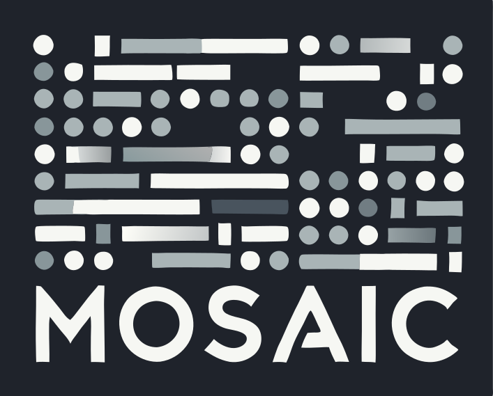

# Mosaic



Mosaic is a grid-first rhythm and harmony sequencer for norns and a 128 grid.
Build patterns, combine them on channels, then shape their output with masks,
scales and parameter locks.

**[Open the interactive manual](manual/index.html)** · [Quick reference](cheat_sheet.html) · [Configuration creator](config_creator.html)

## Install

Install Mosaic through the norns community catalogue, or run this in maiden:

```
;install https://github.com/subvertnormality/mosaic
```

Before replacing an alpha or beta version, preserve projects you want to keep,
then remove the old version and its `data/mosaic` directory.

<a id="devices"></a>

## Connect a sound

Connect your 128 grid and start Mosaic. Choose an external MIDI instrument or
an installed, enabled n.b. sound source. For a stock MIDI device, copy its
configuration from `code/mosaic/lib/config` to `data/mosaic/config`. Assign the
device to a channel and match its MIDI port and channel to the instrument.

[Device setup](manual/index.html#devices) covers stock maps, custom configurations
and internal voices.

<a id="getting-started"></a>

## Make your first loop

Start with a new project and leave Record off:

1. Open Channel with Grid `(3,8)`. Select channel 1. Open Channel tasks → Device,
   choose a working output and press K3 to apply.
2. Open Pattern with Grid `(5,8)` to reach Trig view. Select pattern 1 and tap
   steps `(1,4)` through `(4,4)`.
3. Return to Channel. Assign pattern 1 at `(1,2)`. Hold step 1, tap and release
   step 4, then release step 1 to set a four-step range.
4. Open Channel tasks → Masks. With no step held, set Note to MIDI 60 (shown as
   C3), Vel to 80 and Len to ½.
5. Tap Play `(1,8)` to hear four equal attacks repeating. Tap again to stop.
   With Shift press stop enabled, hold K1 when stopping.

The [First sound walkthrough](manual/index.html#first-sound) shows each control
and its captured screen/grid feedback. If the loop is silent, follow
[No sound](manual/index.html#no-sound). Then [build a phrase](manual/index.html#build-a-phrase)
and [save your work](manual/index.html#keep-your-work).

<a id="masks"></a>

Try [Masks](manual/index.html#masks) to change one channel step's melody or
expression while keeping its source pattern.

## Documentation and development

`manual/book.yaml` and its listed YAML sources are the manual authority. The
HTML manual and quick reference are generated from them. See
[build instructions](manual/BUILD.md), [validation evidence](manual/REPORT.md)
and the [developer instructions](AGENTS.md).

Every feature change must update its affected behaviour tests and manual sections
in the same change. New features need comprehensive behaviour coverage, including
boundaries, failures and interactions, plus full manual sections with practical
workflows and interactive examples. Update the quick reference when controls change.

Manual generation runs in a separate CI workflow on pull requests and on demand.
PR runs provide downloadable preview artifacts. After merge to `main`, a separate
deployment workflow publishes the validated artifact to GitHub Pages without a
second build, after checking that its source tree matches the merged edition. If
there is no matching artifact, an on-demand build is required.

For the 1.4.0 edition merged to `codex/1.4.0`, the trusted publisher on `main`
can promote the exact validated artifact through the documented
[1.4.0 publication procedure](manual/BUILD.md#publish-the-merged-140-edition).
It verifies the merged PR, current branch tip and artifact identity before
publishing that edition.

Local generation and behaviour checks use controlled time. Real-time execution is
reserved for recording assets when necessary; the exhaustive real-time behaviour
campaign runs separately in CI.

The [original 1.4.0 manual](manual/legacy/README-1.4.0.md) is preserved unchanged
so historical behaviour evidence retains its original source identity.
